# Capítulo V: Product Implementation, Validation & Deployment

## 5.1. Software Configuration Management

### 5.1.1. Software Development Environment Configuration

#### Requirements Management

**Jira**: Herramienta de gestión ágil utilizada para organizar y monitorear las tareas del proyecto. Cada actividad fue registrada con una clave única y se asignó a miembros responsables, permitiendo controlar el avance por capítulo.  
Ruta de referencia: [https://www.atlassian.com/software/jira](https://www.atlassian.com/software/jira)

#### Product UX/UI Design

**Figma**: Plataforma online empleada para crear diseños visuales y prototipos navegables tanto para escritorio como dispositivos móvilxes. Fue esencial en la definición de la experiencia de usuario del landing.  
Ruta de referencia: [https://www.figma.com](https://www.figma.com)

#### Software Development

**Visual Studio Code**: Editor de texto utilizado por todos los miembros del equipo, elegido por su ligereza, compatibilidad con múltiples lenguajes y sus extensiones útiles para desarrollo web y control de versiones.  
Ruta de referencia: [https://code.visualstudio.com](https://code.visualstudio.com)

**HTML5 / CSS3 / JavaScript**: Tecnologías base para el desarrollo del sitio web estático. HTML estructura el contenido, CSS define el estilo visual y JavaScript brinda interactividad.

Referencias:
- HTML5: [https://www.w3schools.com/html/html5_syntax.asp](https://www.w3schools.com/html/html5_syntax.asp)
- CSS3: [https://google.github.io/styleguide/htmlcssguide.html](https://google.github.io/styleguide/htmlcssguide.html)
- JavaScript: [https://developer.mozilla.org/es/docs/Web/JavaScript](https://developer.mozilla.org/es/docs/Web/JavaScript)

**Git**: Sistema de control de versiones distribuido usado localmente para manejar el historial de cambios del proyecto.  
Ruta de referencia: [https://git-scm.com](https://git-scm.com)

#### Documentation & Project Hosting

**GitHub**: Plataforma en la nube donde se alojan los repositorios del equipo. Se utilizó para controlar versiones, gestionar ramas con GitFlow y mantener sincronizado el avance entre todos los integrantes.  
Repositorio de la Landing Page:  
[https://github.com/1ASI0730-2510-4370-G1-TocaAqui/Landing-Page](https://github.com/1ASI0730-2510-4370-G1-TocaAqui/Landing-Page)

#### Software Deployment

**GitHub Pages**: Servicio empleado para desplegar el sitio estático del proyecto directamente desde la rama `main`.  
Enlace en producción:  
[https://1asi0730-2510-4370-g1-tocaaqui.github.io/Landing-Page/](https://1asi0730-2510-4370-g1-tocaaqui.github.io/Landing-Page/)

**Vercel (previsto)**: Plataforma que será usada en los próximos sprints para desplegar la aplicación frontend en Vue.js, permitiendo despliegues automáticos desde GitHub.  
Ruta de referencia: [https://vercel.com](https://vercel.com)


### 5.1.2. Source Code Management

El equipo aplica la estrategia GitFlow, que organiza el desarrollo con ramas específicas para cada tipo de contribución. Las ramas implementadas en este Sprint fueron:

- `main`: contiene la versión estable desplegada
- `develop`: utilizada como base para integrar avances
- `feature/*`: se creó una rama por cada funcionalidad nueva del landing page

Durante este primer Sprint, se realizó trabajo activo en ramas `feature/*`, que luego fueron integradas mediante `merge` hacia la rama `main` para el despliegue en GitHub Pages. La estructura de ramas puede verse directamente en el historial del repositorio.

   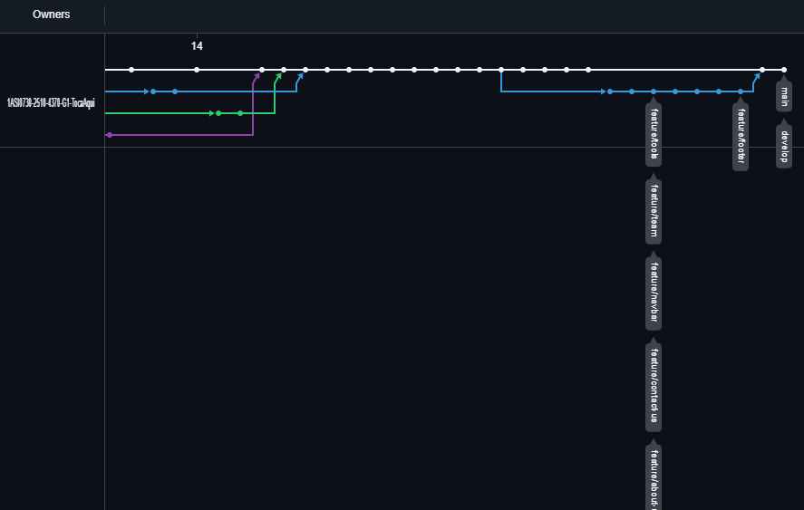


Repositorio principal:  
[https://github.com/1ASI0730-2510-4370-G1-TocaAqui/Landing-Page](https://github.com/1ASI0730-2510-4370-G1-TocaAqui/Landing-Page)

**Commits estructurados (Conventional Commits)**  
Se siguió el estándar [Conventional Commits](https://www.conventionalcommits.org) para mantener claridad y coherencia en el historial del proyecto. Ejemplos reales incluidos:

- `feat(html): added material design`
- `style(icons): replace RemixIcon with Material Design Icons library`
- `feat(a11y): add ARIA attributes to main navigation and header sections`
- `docs(readme): update documentation for UPC university project`


### 5.1.3. Source Code Style Guide & Conventions


#### HTML

- Todas las etiquetas deben cerrarse correctamente
- Comentarios cortos en línea
- Uso obligatorio de atributos `alt`, `width`, `height` en imágenes
- Nombres de clases en inglés, en lower-case con guiones

Referencia: [https://www.w3schools.com/html/html5_syntax.asp](https://www.w3schools.com/html/html5_syntax.asp)

#### CSS

- Indentación de 2 espacios
- Código en minúscula y limpio
- Comentarios explicativos por bloque
- Nombres de clase descriptivos y semánticos

Referencia: [https://google.github.io/styleguide/htmlcssguide.html](https://google.github.io/styleguide/htmlcssguide.html)

#### JavaScript

- Variables con nombres representativos
- Uso coherente de comillas (simples o dobles)
- Funciones modulares y reutilizables
- Comentarios en secciones complejas
- Evitar variables globales

Referencia: [https://developer.mozilla.org/es/docs/Web/JavaScript](https://developer.mozilla.org/es/docs/Web/JavaScript)

#### Vue.js (para sprints futuros)

- Carpetas organizadas por módulos: `components/`, `views/`, `store/`
- Reutilización de componentes
- Separación clara entre lógica y vista
- Documentación interna con props, eventos y métodos

Referencia: [https://vuejs.org/guide/introduction](https://vuejs.org/guide/introduction)

### 5.1.4. Software Deployment Configuration

Para desplegar la **Landing Page** del proyecto **TocaAquí** usando **GitHub Pages**, se siguieron los siguientes pasos:

1. **Ubicar el repositorio del proyecto**  
   Se accede al repositorio público alojado en GitHub que contiene el código fuente del sitio:  
   

2. **Ir a la sección de configuración (Settings)**  
   En la barra superior del repositorio, se hace clic en la pestaña **Settings**.

   

3. **Configurar GitHub Pages desde una rama**  
   En la sección **Pages**, dentro de **Build and deployment**, se selecciona `Deploy from a branch`.  
   Luego, se elige la rama `main` y la carpeta raíz `/ (root)` como origen del contenido.

   

Una vez configurado, GitHub genera automáticamente la URL pública del sitio, que queda disponible para validación, pruebas o entrevistas con usuarios.

**URL:** [`https://1asi0730-2510-4370-g1-tocaaqui.github.io/Landing-Page/index.html`](https://1asi0730-2510-4370-g1-tocaaqui.github.io/Landing-Page/index.html)

## 5.2. Landing Page, Services & Applications Implementation
### 5.2.1. Sprint 1
#### 5.2.1.1. Sprint Planning 1

| **Sprint #**                      | **Sprint 1**                                                                 |
|----------------------------------|------------------------------------------------------------------------------|
| **Sprint Planning Background**   |                                                                              |
| **Date**                         | 11/04/2025                                                                   |
| **Time**                         | 05:00 PM                                                                     |
| **Location**                     | Servidor de Discord del Equipo                                               |
| **Prepared By**                  | Oscar Antayhua                                                              |
| **Attendees (to planning meeting)** | Oscar Antayhua / Juan Llamccaya / Nelson Pereira / Diego Cabrera / Eddo Su Caletti |
| **Sprint 1 Review Summary**      |   Durante este sprint, el equipo trabajó en la base del proyecto: se desarrolló, diseñó y publicó la primera versión funcional de la landing page, incluyendo componentes clave como la descripción del servicio, los planes de suscripción, formularios de contacto y estructura multilenguaje. También se completaron actividades de UX como User Personas, Journey Maps y arquitectura de información.                                                                           |
| **Sprint 1 Retrospective Summary** |      Los integrantes coincidieron en que el trabajo en equipo fue eficiente y colaborativo. Se destacaron aciertos en la integración de herramientas como UXPressia, Figma y el diseño responsivo. Como mejora, se mencionó optimizar la gestión de tiempos entre subtareas y usar criterios de aceptación más claros desde el inicio.                                                                      |
| **Sprint Goal & User Stories**   |        Completar la fase de descubrimiento e investigación, validación de usuarios, análisis de la competencia, arquitectura de información y base de la landing.                                                                     |
| **Sprint 1 Goal**                |   Nuestro objetivo es desarrollar una landing page completa y coherente con el enfoque del proyecto “TocaAquí”, asegurando que fuera funcional, responsiva, accesible y atractiva para artistas y locales. Este sprint también sentó las bases para la experiencia del usuario mediante entregables como los User Personas, Empathy Maps, Wireframes y Style Guides.                                                                           |
| **Sprint 1 Velocity**            | 4 Velocity                                                                   |
| **Sum of Story Points**          | 6 Story Points                                                               |

#### 5.2.1.2. Aspect Leaders and Collaborators

| Team Member              | GitHub Username     | Landing Page | Diseño UI/UX | HTML/CSS | JavaScript | Documentación |
|--------------------------|---------------------|--------------|---------------|----------|-------------|----------------|
| Nelson Pereira           | fabrizzioper        | C            | C             | C        | L           | C              |
| Oscar Antayhua           | OscarAntayhuaCastillo | L            | C             | C        | C           | L              |
| Juan Llamccaya           | JuanPaulLla        | C            | C             | L        | C           | C              |
| Diego Cabrera            | omele7             | C            | C             | C        | L           | C              |
| Eddo Su Caletti          | Asalreon520        | C            | L             | C        | C           | C              |

#### 5.2.1.3. Sprint Backlog 1


| **User Story Id** | **User Story Title** | **Work-Item/Task Id** | **Work-Item/Task Title** | **Description** | **Estimation** | **Assigned To** | **Status** |
|:-----------------:|:--------------------:|:---------------------:|:-----------------------:|:---------------:|:--------------:|:--------------:|:----------:|
| US01 | Acceso a la Landing Page desde distintos dispositivos | T01 | Diseño responsivo | Ajustar estilos CSS para adaptación en mobile, tablet y desktop | 5h | Juan Llamccaya | Done |
| US02 | Visualización de información del propósito | T02 | Redacción de sección "Sobre Nosotros" | Crear texto descriptivo para explicar misión y beneficios de TocaAquí | 3h | Nelson Pereira | Done |
| US03 | Visualización de imágenes y gráficos relevantes | T03 | Selección y carga de imágenes | Seleccionar imágenes ilustrativas y cargarlas en la landing page | 2h | Diego Cabrera | Done |
| US04 | Tipografía cómoda y agradable estéticamente | T04 | Definición de tipografía y estilos | Elegir y aplicar fuentes estéticas y legibles para todo el sitio | 3h | Eddo Su Caletti | Done |
| US05 | Opción de navegación entre secciones | T05 | Implementación de navegación | Programar menú de navegación funcional con anclas internas | 4h | Oscar Antayhua | Done |
| US06 | Formulario de contacto funcional | T06 | Desarrollo de formulario de contacto | Crear y validar formulario de contacto en HTML, CSS y JavaScript | 5h | Diego Cabrera | Done |


#### 5.2.1.4. Development Evidence for Sprint Review

| Repository                                   | Branch | Commit Id | Commit Message                                           | Commit Message Body (resumen)                                                 | Committed on  |
|----------------------------------------------|--------|-----------|----------------------------------------------------------|--------------------------------------------------------------------------------|----------------|
| Landing-Page                                 | main   | 66dc745   | style(icons): update social media icons to Material Design in English version | Actualización de íconos en versión en inglés                                  | Apr 14, 2025   |
| Landing-Page                                 | main   | 7a73592   | Merge branch 'develop'                                  | Fusión de cambios desde rama develop                                           | Apr 14, 2025   |
| Landing-Page                                 | main   | 96d4570   | styles(webkit): fix errors on webkit background         | Correcciones visuales para navegadores WebKit                                 | Apr 14, 2025   |
| Landing-Page                                 | main   | e7d5c76   | feat(html): added material design.                      | Integración de Material Design a la estructura HTML                            | Apr 14, 2025   |
| Landing-Page                                 | main   | 041541c   | style(icons): replace RemixIcon with Material Design Icons library | Reemplazo de biblioteca de íconos por Material Design Icons                  | Apr 14, 2025   |
| Landing-Page                                 | main   | 4f76ad4   | feat(redes-sociales): added social icons                | Adición de íconos de redes sociales                                            | Apr 14, 2025   |
| Landing-Page                                 | main   | fe42468   | feat(a11y): add ARIA attributes to main navigation and header sections | Mejora de accesibilidad usando atributos ARIA                                | Apr 14, 2025   |
| Landing-Page                                 | main   | 3a2b1c0   | feat(assets): added nelson picture profile              | Imagen de perfil agregada a los assets                                         | Apr 14, 2025   |
| Landing-Page                                 | main   | f48a5df   | feat(html): added nelson profile picture url            | URL de imagen de perfil de Nelson en HTML                                      | Apr 14, 2025   |
| Landing-Page                                 | main   | 72f9f94   | fix(readme): fix year                                   | Corrección del año en README                                                  | Apr 14, 2025   |
| Landing-Page                                 | main   | 8102961   | docs(readme): update documentation for UPC university project | Actualización de README con detalles del proyecto universitario             | Apr 14, 2025   |
| Landing-Page                                 | main   | 8a13d40   | fix(styles): add standard background-clip property for cross-browser compatibility | Mejora de compatibilidad CSS                                                 | Apr 13, 2025   |
| Landing-Page                                 | main   | 3c01cbf   | fix(team): fix alt names.                               | Corrección de textos alternativos para accesibilidad                          | Apr 13, 2025   |
| Landing-Page                                 | main   | d2349fe   | style(responsive): enhance mobile layout and responsiveness | Mejora de estilos responsive                                                 | Apr 13, 2025   |
| Landing-Page                                 | main   | b84e7c7   | feat(hero): add segmentation buttons and improve responsive design | Botones segmentados para artistas y locales en la sección principal         | Apr 13, 2025   |
| Landing-Page                                 | main   | 9aeb89a   | fix(spaces-name): fixed spaces names and changed to venues and locales | Cambio de texto: "spaces" por "venues/locales"                              | Apr 13, 2025   |
| Landing-Page                                 | main   | 877734e   | feat(main.js): added event listener for plans           | JS para detectar selección de planes                                           | Apr 13, 2025   |
| Landing-Page                                 | main   | d7c58d5   | feat(assets): added some assets                         | Nuevos recursos gráficos                                                       | Apr 13, 2025   |
| Landing-Page                                 | main   | e9cf84f   | feat(styles): added some styles for different sections of html | Estilos adicionales para secciones varias                                  | Apr 13, 2025   |
| Landing-Page                                 | main   | 4041d0e   | feat(main-en): added javascript function for english landing page | Funcionalidad en JS para cambio de idioma                                    | Apr 13, 2025   |
| Landing-Page                                 | main   | b542750   | feat(landing-page): added plans and fix html structure  | Incorporación de planes y corrección de estructura                            | Apr 13, 2025   |
| Landing-Page                                 | main   | 257f243   | feat(index): Added english landing page                 | Se creó la versión en inglés de la landing                                     | Apr 13, 2025   |
| Landing-Page                                 | main   | 9eab618   | Merge branch 'feature/team' into develop                | Fusión de rama feature/team                                                   | Apr 12, 2025   |
| Landing-Page                                 | main   | a61b54a   | Merge branch 'feature/contact-us' into develop          | Fusión de rama feature/contact-us                                            | Apr 12, 2025   |
| Landing-Page                                 | main   | e34ae9a   | Merge branch 'feature/footer' into develop              | Fusión de rama feature/footer                                                | Apr 12, 2025   |
| Landing-Page                                 | main   | 5efaecc   | feat(styles): added some contact-us section styles      | Estilos para sección de contacto                                              | Apr 12, 2025   |
| Landing-Page                                 | main   | 1e1660d   | feat(contact-us): section contact-us added to html      | Maquetado HTML de la sección de contacto                                      | Apr 12, 2025   |
| Landing-Page                                 | main   | 40a6d3e   | fix(about-experience): fix duplicated content           | Corrección de contenido duplicado                                             | Apr 12, 2025   |
| Landing-Page                                 | main   | 9bfe3d2   | feat(team): update styles.css with responsive team section design | Diseño responsive de sección equipo                                        | Apr 11, 2025   |
| Landing-Page                                 | main   | 39e1e3e   | feat(team): add team section with basic structure and styles | Sección del equipo con estructura básica y estilos                         | Apr 11, 2025   |
| Landing-Page                                 | main   | 0a7f37f   | feat(about-experience): add experience section markup and styles | Sección de experiencia implementada                                        | Apr 11, 2025   |
| Landing-Page                                 | main   | 70e1ee6   | feat(contact): add styles for contact section            | Estilos CSS de la sección contacto                                            | Apr 11, 2025   |
| Landing-Page                                 | main   | 3d10749   | feat(footer): add footer section and structure          | Pie de página agregado                                                        | Apr 11, 2025   |
| Landing-Page                                 | main   | 58d02cc   | feat: added the experience section                      | Sección de experiencia general agregada                                       | Apr 11, 2025   |
| Landing-Page                                 | main   | 1c8b0e4   | feat: updated the landing page                          | Actualización general de la estructura de la landing                          | Apr 11, 2025   |
| Landing-Page                                 | main   | 62d0c5e   | feat(home): add hero section styles and animation       | Animación y estilos del home                                                  | Apr 08, 2025   |
| Landing-Page                                 | main   | 801c76e   | feat(about-us): add about section markup and styling    | Sección sobre nosotros                                                        | Apr 08, 2025   |
| Landing-Page                                 | main   | 9ff7dd7   | feat(assets): add about and home background             | Fondos de secciones                                                            | Apr 08, 2025   |
| Landing-Page                                 | main   | b74b1a2   | feat(assets): add light and dark versions of logo images | Versiones claras y oscuras del logo                                         | Apr 08, 2025   |
| Landing-Page                                 | main   | 3a20ccf   | feat(navbar): add responsive styles for navigation       | Estilos responsive para navbar                                                | Apr 08, 2025   |
| Landing-Page                                 | main   | 1c325e4   | feat(navbar): main js created                          | Funcionalidad JS para navegación                                              | Apr 08, 2025   |
| Landing-Page                                 | main   | 6f37fc7   | feat(navbar): index created                            | Archivo inicial index                                                         | Apr 08, 2025   |
| Landing-Page                                 | main   | 8e06aeb   | Create Readme.md                                        | README base creado                                                            | Apr 07, 2025   |

#### 5.2.1.5. Execution Evidence for Sprint Review
Para este primer Sprint, hemos desarrollado la Landing Page del proyecto "TocaAquí". A través de esta landing, los usuarios pueden visualizar de forma clara la propuesta de valor de nuestra plataforma, destinada a conectar músicos emergentes con locales de eventos, facilitando la contratación, coordinación y pagos seguros.

A continuación, se presentan las User Stories asociadas que se ejecutaron y evidencian el trabajo realizado:

| **ID** | **User Story** | **Evidencia en Landing Page** |
|:------:|:--------------:|:-----------------------------:|
| US01 | Acceso a la Landing Page desde distintos dispositivos | Visualización responsive en computadoras y móviles |
| US02 | Visualización de la información del propósito | Sección "Sobre Nosotros" describiendo la solución |
| US03 | Visualización de imágenes y gráficos relevantes | Imágenes en las secciones principales (home, about) |
| US04 | Tipografía cómoda y estéticamente agradable | Fuente limpia y moderna compatible con el estilo |
| US05 | Opción de navegación entre secciones | Menú de navegación y botones de acción funcionales |
| US06 | Formulario de contacto funcional | Sección de contacto con campos de entrada validados |

**Sección Sobre Nosotros**  
Muestra el propósito de TocaAquí, permitiendo al visitante entender rápidamente el objetivo de la plataforma.


**Nuestro Equipo**  
Se exhiben los perfiles de los desarrolladores de la startup, reforzando la transparencia y profesionalismo del proyecto.


**Planes Disponibles**  
Se muestra una estructura clara de planes para artistas y locales, acompañada de botones de acción intuitivos.


**Formulario de Contacto**  
Formularios para el envío de mensajes de contacto, cumpliendo criterios de accesibilidad y usabilidad.


#### 5.2.1.6. Services Documentation Evidence for Sprint Review

Durante el Sprint 1 no se trabajaron endpoints documentados, ya que el alcance se centró exclusivamente en el desarrollo del Landing Page. La documentación OpenAPI comenzará en el Sprint 2.

#### 5.2.1.7. Software Deployment Evidence for Sprint Review

Durante el Sprint 1, se realizó el despliegue de la landing page del proyecto utilizando **GitHub Pages**.

- **Repositorio:** [Landing-Page](https://github.com/1ASI0730-2510-4370-G1-TocaAqui/Landing-Page)
- **URL de producción:** [https://1asi0730-2510-4370-g1-tocaaqui.github.io/Landing-Page/](https://1asi0730-2510-4370-g1-tocaaqui.github.io/Landing-Page/)
- **Branch desplegado:** `main`

El sitio fue configurado y publicado correctamente, permitiendo acceso público a las secciones: Home, About Us, Team, Contact y Planes.


#### 5.2.1.8. Team Collaboration Insights during Sprint

Durante el desarrollo del Sprint 1, se evidenció una participación activa y distribuida entre los integrantes del equipo, reflejada tanto en la frecuencia de commits como en las funcionalidades aportadas. En total, se realizaron 39 commits, los cuales fueron generados por 5 autores diferentes, destacando la colaboración en ramas específicas como feature/about-us, feature/navbar y develop, todas correctamente integradas mediante pull requests.

| Integrante             | Commits | Líneas añadidas | Líneas eliminadas | Áreas de contribución principales                                                                 |
|------------------------|---------|------------------|--------------------|---------------------------------------------------------------------------------------------------|
| Oscar Antayhua Castillo | 32      | 2896             | 929                | Navegación, accesibilidad (ARIA), responsive, estilos, íconos, estructura HTML, despliegue GitHub Pages |
| JuanPaulLla            | 2       | 181              | 2                  | Sección de equipo (team), ajustes visuales                                                        |
| Asalreon520            | 2       | 132              | 0                  | Footer, sección de contacto                                                                       |
| omele7                 | 2       | 114              | 2                  | Sección de experiencia, mejoras generales en la landing                                           |
| fabrizzioper           | 1       | 112              | 0                  | Estructura y estilos de la sección experiencia                                                    |


Commits:
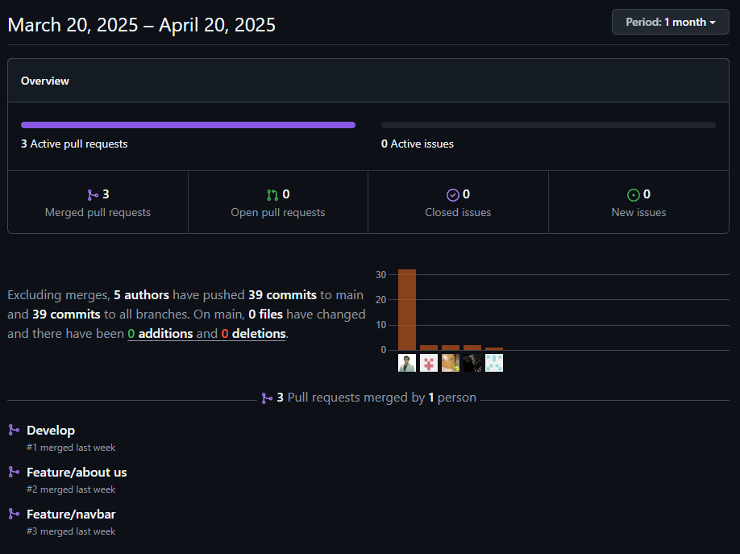

Analiticas de Colaboración:
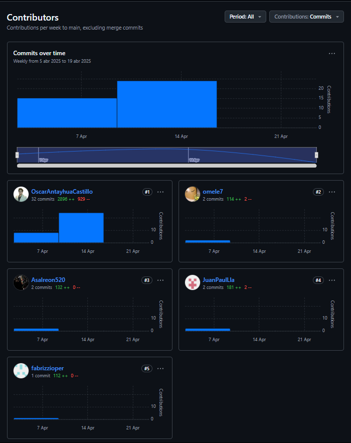


### 5.2.2. Sprint 2
#### 5.2.2.1. Sprint Planning 2

| Sprint # | Sprint 2 |
|----------------------------------|------------------------------------------------------------------------------|
| Sprint Planning Background | |
| Date | 05/05/2025 |
| Time | 05:00 PM |
| Location | Servidor de Discord del Equipo |
| Prepared By | Oscar Antayhua |
| Attendees (to planning meeting) | Oscar Antayhua / Juan Llamccaya / Nelson Pereira / Diego Cabrera / Eddo Su Caletti |
| Sprint 2 Review Summary | Durante este sprint, el equipo se enfocó en el desarrollo de la aplicación web principal utilizando Vue.js y PrimeVue como biblioteca de componentes UI. Se implementó un backend simulado con JSON Server para el desarrollo rápido de prototipos. Se completaron las funcionalidades clave del dashboard, gestión de eventos, sistema de pagos y calificaciones. |
| Sprint 2 Retrospective Summary | El equipo destacó la productividad alcanzada con Vue.js y la calidad de los componentes de PrimeVue. El uso de JSON Server facilitó el desarrollo del frontend sin dependencias de un backend real. Como puntos de mejora, se identificó la necesidad de mejorar la gestión del estado con Pinia y optimizar las llamadas a la API. |
| Sprint Goal & User Stories | Desarrollar la primera versión de la aplicación web que permita a artistas y locales gestionar sus perfiles, eventos, pagos y calificaciones. Implementar la autenticación de usuarios, sistema de gestión de eventos, módulo de pagos y funcionalidades básicas de interacción entre artistas y locales utilizando Vue.js, PrimeVue y JSON Server como stack tecnológico. |
| Sprint 2 Goal | Nuestro objetivo es implementar la primera versión funcional de la aplicación web que permita a los usuarios registrarse, gestionar sus perfiles, coordinar eventos y realizar seguimiento de pagos. La aplicación debe ofrecer una experiencia fluida y moderna utilizando Vue.js y PrimeVue, con datos simulados mediante JSON Server para facilitar el desarrollo y pruebas. |
| Sprint 2 Velocity | 6 Velocity |
| Sum of Story Points | 8 Story Points |


#### 5.2.2.2. Aspect Leaders and Collaborators

| Team Member | GitHub Username | Frontend | Backend | UI/UX | Testing | Documentation |
|------------|----------------|-----------|---------|-------|---------|---------------|
| Nelson Pereira | fabrizzioper | C | L | C | C | C |
| Oscar Antayhua | OscarAntayhuaCastillo | L | C | C | C | L |
| Juan Llamccaya | JuanPaulLla | C | C | L | C | C |
| Diego Cabrera | omele7 | C | C | C | L | C |
| Eddo Su Caletti | Asalreon520 | C | C | C | C | C |

#### 5.2.2.3. Sprint Backlog 2

| **User Story Id** | **User Story Title** | **Work-Item/Task Id** | **Work-Item/Task Title** | **Description** | **Estimation** | **Assigned To** | **Status** |
|:-----------------:|:--------------------:|:---------------------:|:-----------------------:|:---------------:|:--------------:|:--------------:|:----------:|
| US07 | Registro como artista en la plataforma | T01 | Implementar formulario de registro | Crear formulario con validaciones para registro de artistas con Vue.js y PrimeVue | 8h | Nelson Pereira | Done |
| US08 | Acceso al dashboard personalizado de artista | T02 | Diseño y desarrollo del dashboard | Implementar vista principal con módulos de perfil, postulaciones, agenda y pagos | 10h | Oscar Antayhua | Done |
| US09 | Búsqueda de eventos compatibles con mi perfil | T03 | Sistema de búsqueda y filtros | Desarrollar funcionalidad de búsqueda y filtrado de eventos por género y ubicación | 12h | Juan Llamccaya | Done |
| US10 | Postulación rápida a un evento desde la plataforma | T04 | Proceso de postulación | Implementar flujo de postulación a eventos con confirmaciones | 8h | Diego Cabrera | Done |
| US11 | Gestión y edición de mi perfil artístico | T05 | Editor de perfil | Crear interfaz para editar biografía, estilo musical y contenido multimedia | 6h | Eddo Su Caletti | Done |
| US33 | Visualización de pagos recibidos y pendientes | T06 | Panel de pagos | Implementar vista de pagos con estados y detalles | 8h | Nelson Pereira | Done |
| US34 | Visualización de agenda de eventos | T07 | Calendario de eventos | Desarrollar vista de agenda con eventos confirmados y estados | 10h | Oscar Antayhua | Done |
| US27 | Visualización de próximos eventos agendados | T08 | Widget de eventos próximos | Crear componente de resumen de eventos en el dashboard | 6h | Juan Llamccaya | Done |
| US28 | Visualización de pagos pendientes desde el dashboard | T09 | Widget de pagos pendientes | Implementar componente de resumen de pagos en el panel principal | 6h | Diego Cabrera | Done |
| US29 | Acceso rápido a calificaciones recibidas | T10 | Sistema de calificaciones | Desarrollar módulo de visualización de calificaciones y reviews | 8h | Eddo Su Caletti | Done |


#### 5.2.2.4. Development Evidence for Sprint Review

| Repository        | Branch | Commit Id | Commit Message                                                             | Commit Message Body (resumen)                                                  | Committed on  |
|-------------------|--------|-----------|-----------------------------------------------------------------------------|-------------------------------------------------------------------------------|---------------|
| TocaAqui-WebApp   | develop | 933ae7e   | fix(http): fixed                                                            | Corrección de errores en el módulo HTTP                                        | May 15, 2025  |
| TocaAqui-WebApp   | develop | 8293ae9   | feat(http): added json server multiple endpoints fix                        | Solución para manejar múltiples endpoints en JSON Server                       | May 15, 2025  |
| TocaAqui-WebApp   | develop | 0db86e3   | Merge branch 'feature/event-evaluation' into develop                        | Fusión de la rama feature/event-evaluation en develop                          | May 15, 2025  |
| TocaAqui-WebApp   | develop | c358de9   | fix(db): fixed                                                              | Corrección de errores en la base de datos                                       | May 15, 2025  |
| TocaAqui-WebApp   | develop | e2dbd5f   | Merge branch 'login' into develop                                           | Integración de la rama login en develop                                        | May 15, 2025  |
| TocaAqui-WebApp   | develop | bdb2cac   | refactor(dashboard): refactor dashboard bounded context                     | Refactorización de dashboard en su contexto delimitado                         | May 15, 2025  |
| TocaAqui-WebApp   | develop | 03028f4   | feat(event): added rider document upload function                           | Función para subir documentos de riders en eventos                             | May 15, 2025  |
| TocaAqui-WebApp   | develop | c0c85dc   | feat(evaluations): fixed the problem of adding evaluations to events        | Solución al problema de registro de evaluaciones en eventos                    | May 15, 2025  |
| TocaAqui-WebApp   | develop | 61c7b72   | fix(even-application): fixed post sign                                      | Corrección de errores en la firma de envíos de la aplicación de eventos         | May 15, 2025  |
| TocaAqui-WebApp   | develop | ff60507   | feat(schedule): added i18n                                                  | Se añade internacionalización (i18n) en schedule                               | May 15, 2025  |
| TocaAqui-WebApp   | develop | e5556d9   | fix(index): fix div id app                                                  | Corrección de ID de div en la aplicación                                       | May 15, 2025  |
| TocaAqui-WebApp   | develop | 5447a33   | feat(index): added comment                                                  | Comentarios añadidos en index para mejorar la legibilidad                      | May 15, 2025  |
| TocaAqui-WebApp   | develop | 3269301   | Fix rollup native module issue - clean install                              | Corrección de errores de módulos nativos en Rollup con reinstalación limpia    | May 15, 2025  |
| TocaAqui-WebApp   | develop | 68ba287   | feat(core): added pnpm                                                      | Integración de pnpm como gestor de paquetes                                    | May 15, 2025  |
| TocaAqui-WebApp   | develop | 0dfe5b0   | fix(node-modules): Fix rollup native module issue - reinstall node_modules  | Reinstalación de node_modules para corregir problemas con Rollup                | May 15, 2025  |
| TocaAqui-WebApp   | develop | ff4bfec   | fix(evaluation): fixed route                                                | Corrección de la ruta de evaluaciones                                          | May 15, 2025  |
| TocaAqui-WebApp   | develop | f43b1fe   | Merge branch 'feature/payment-processing' into develop                      | Fusión de la rama feature/payment-processing en develop                        | May 15, 2025  |
| TocaAqui-WebApp   | develop | 6a65d7a   | fix(evaluation): ixed                                                       | Corrección de errores en evaluaciones (typo "ixed")                            | May 15, 2025  |
| TocaAqui-WebApp   | develop | b9de9c4   | feat(db): updated database                                                  | Actualización de la base de datos                                              | May 15, 2025  |
| TocaAqui-WebApp   | develop | 4e2e810   | feat(event): updated calendar                                               | Actualización del componente de calendario de eventos                          | May 15, 2025  |
| TocaAqui-WebApp   | develop | a8163f5   | faet(events-card-schedule): updated                                         | Corrección y actualización del módulo card-schedule de eventos                 | May 15, 2025  |
| TocaAqui-WebApp   | develop | bd0086c   | feat(i18n): updated                                                         | Actualización de textos e internacionalización                                | May 15, 2025  |
| TocaAqui-WebApp   | develop | 92ebb40   | feat(dashboard): updated                                                    | Mejoras y actualizaciones visuales en el dashboard                             | May 15, 2025  |
TocaAqui-WebApp | develop | 85fa1bf | Merge branch 'feature/event-evaluation' into develop | Fusión de la rama feature/event-evaluation en develop | May 14, 2025
TocaAqui-WebApp | develop | 5029090 | feat:added changes to compile | Ajustes para compilar correctamente | May 14, 2025
TocaAqui-WebApp | develop | 29fc6c0 | feat:added evaluation content of bounded context | Agrega contenido de evaluación en bounded context | May 14, 2025
TocaAqui-WebApp | develop | 3b8a1b6 | feat(profile): added the profile section and his editing functionality | Sección de perfil y su funcionalidad de edición | May 14, 2025
TocaAqui-WebApp | develop | 207edb0 | Merge branch 'develop' into feature/payment-processing | Sincronización de develop en feature/payment-processing | May 14, 2025
TocaAqui-WebApp | develop | 64c8614 | fix(payment.service): fix http request | Corrección en el servicio de pagos para las solicitudes http | May 14, 2025
TocaAqui-WebApp | develop | 2694dc3 | feat(inxed.js): added new routes | Agrega nuevas rutas en inxed.js | May 14, 2025
TocaAqui-WebApp | develop | 043e0fc | feat(contrac-dialog): added and setup component | Configuración inicial del componente de diálogo de contrato | May 14, 2025
TocaAqui-WebApp | develop | 7b2a77a | feat(shared-components): added shared components | Se agregan componentes compartidos al proyecto | May 14, 2025
TocaAqui-WebApp | develop | 3530b69 | feat(event): added new information to the event | Se añade nueva información a los eventos | May 14, 2025
TocaAqui-WebApp | develop | 4aa8f85 | feat(payment): added payment bounded context | Implementación del bounded context para pagos | May 14, 2025
TocaAqui-WebApp | develop | 3473bc3 | refactor(shared-components): remove useless components | Eliminación de componentes innecesarios | May 14, 2025
TocaAqui-WebApp | develop | a6897b8 | feat(tracking): added tacking component | Se añade el componente de tracking | May 14, 2025
TocaAqui-WebApp | develop | 251cd88 | fix(dashboard): fdixed primevue components called | Corrección de llamadas a componentes de PrimeVue en dashboard | May 14, 2025
TocaAqui-WebApp | develop | d91b7af | feat(main.js): added new components | Nuevos componentes añadidos en main.js | May 14, 2025
TocaAqui-WebApp | develop | ce89e73 | fix(app): fixed components routes | Corrección de rutas de componentes en la app | May 14, 2025
TocaAqui-WebApp | develop | 6c90a14 | feat(db): added new endpoints | Nuevos endpoints añadidos a la base de datos | May 14, 2025
TocaAqui-WebApp | develop | d8f4327 | feat(i18n): added information to translate | Información adicional para traducción | May 14, 2025
TocaAqui-WebApp | develop | 48029d5 | feat:added some changes to compile project | Cambios para mejorar la compilación del proyecto | May 14, 2025
TocaAqui-WebApp | develop | 48c57d5 | Merge remote-tracking branch 'origin/develop' into develop | Actualización desde origin/develop | May 14, 2025
TocaAqui-WebApp | develop | 6fd29d6 | feat:added some changes to compile project | Mejoras para asegurar la compilación | May 14, 2025
TocaAqui-WebApp | develop | 460dc14 | feat(db.json):feat added events data | Datos de eventos añadidos en db.json | May 14, 2025
TocaAqui-WebApp | develop | eb5020c | Merge remote-tracking branch 'origin/feature/user-portal' into develop | Fusión de la rama feature/user-portal en develop | May 14, 2025
TocaAqui-WebApp | develop | 6f827b6 | feat(added): added dependencies | Se agregan dependencias al proyecto | May 14, 2025
TocaAqui-WebApp | develop | cdd14c0 | feat(payments): add the payments section of the artist | Añadida sección de pagos para artistas | May 14, 2025
TocaAqui-WebApp | develop | 38fe1c4 | feat(login): fixed the register section and fixed the styles | Corrección de la sección de registro y estilos | May 14, 2025
TocaAqui-WebApp | develop | cd549f8 | feat(i18n): added new information | Nuevos textos añadidos para internacionalización | May 14, 2025
TocaAqui-WebApp | develop | cab8872 | feat(dashboard): added events info to dashboard | Información de eventos añadida al dashboard | May 14, 2025
TocaAqui-WebApp | develop | 283deab | feat(event): added information and contract | Se añaden detalles e información contractual | May 14, 2025
TocaAqui-WebApp | develop | eaac858 | feat(db): added events application database | Base de datos para gestión de eventos añadida | May 14, 2025
TocaAqui-WebApp | develop | 59560d6 | feat(app): added pinia | Integración de Pinia para gestión de estado | May 14, 2025
TocaAqui-WebApp | develop | 2319bcf | fix(login): login fixed | Corrección de errores en el login | May 14, 2025
TocaAqui-WebApp | develop | 9279308 | fix(primevue-theme): fixed primevue theme | Ajustes en el tema visual de PrimeVue | May 14, 2025


#### 5.2.2.5. Execution Evidence for Sprint Review
Durante el Sprint 2, hemos desarrollado la primera versión de la aplicación web utilizando Vue.js, PrimeVue y JSON Server. A continuación, se presentan las User Stories implementadas y su evidencia:

| **ID** | **User Story** | **Evidencia en Aplicación** |
|:------:|:--------------:|:-----------------------------:|
| US07 | Registro como artista en la plataforma | Formulario de registro implementado con validaciones y selección de rol |
| US08 | Acceso al dashboard personalizado de artista | Panel principal con vista general de actividades y métricas |
| US09 | Búsqueda de eventos compatibles con mi perfil | Sistema de búsqueda con filtros por género y ubicación |
| US10 | Postulación rápida a un evento desde la plataforma | Proceso simplificado de postulación a eventos |
| US11 | Gestión y edición de mi perfil artístico | Editor de perfil con campos para biografía y multimedia |
| US33 | Visualización de pagos recibidos y pendientes | Panel detallado de estados de pagos y transacciones |
| US34 | Visualización de agenda de eventos | Calendario interactivo con eventos confirmados |
| US27 | Visualización de próximos eventos agendados | Widget de resumen de próximos shows en dashboard |
| US28 | Visualización de pagos pendientes desde el dashboard | Indicadores de pagos pendientes y estados |
| US29 | Acceso rápido a calificaciones recibidas | Sistema de visualización de reviews y ratings |

**Dashboard Principal del Artista**  
Panel centralizado que muestra las funcionalidades principales implementadas para los artistas.

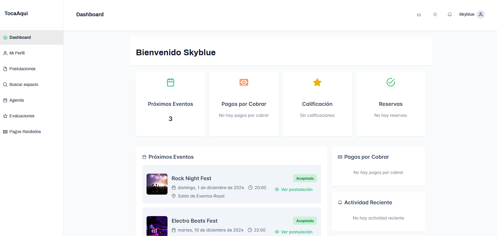

**Características implementadas:**

1. **Sistema de Autenticación**
   - Registro de usuarios con roles específicos
   - Login seguro con validaciones
   - Recuperación de contraseña

2. **Dashboard Personalizado**
   - Vista general de actividades
   - Métricas importantes
   - Accesos rápidos a funciones principales

3. **Gestión de Eventos**
   - Búsqueda avanzada de eventos
   - Filtros por género y ubicación
   - Sistema de postulaciones

4. **Sistema de Pagos**
   - Visualización de estados de pago
   - Historial de transacciones
   - Indicadores de pagos pendientes

5. **Agenda y Calendario**
   - Vista de eventos confirmados
   - Organización temporal de shows
   - Estados de contratos y pagos

6. **Perfiles y Evaluaciones**
   - Editor de perfil artístico
   - Sistema de calificaciones
   - Historial de reviews

**Stack Tecnológico Utilizado:**
- Frontend: Vue.js 3 + PrimeVue
- Backend Simulado: JSON Server
- Estilos: CSS personalizado
- Gestión de Estado: Vue Router + Pinia
- Despliegue: Vercel

#### 5.2.2.6. Services Documentation Evidence for Sprint Review

**API Endpoints implementados con JSON Server:**

```json
{
  "users": "/api/users",
  "events": "/api/events",
  "payments": "/api/payments",
  "evaluation": "/api/evaluation"
}
```

#### 5.2.2.7. Software Deployment Evidence for Sprint Review

Durante el Sprint 2, se realizó el despliegue de la Web Application utilizando **Vercel**.
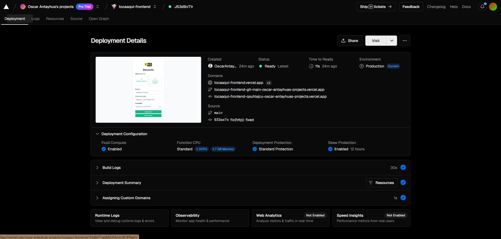


- **Repositorio:** [Web Application](https://github.com/1ASI0730-2510-4370-G1-TocaAqui/Landing-Page)
- **URL de producción:** [https://tocaaqui-frontend.vercel.app/](https://tocaaqui-frontend.vercel.app/)
- **Branch desplegado:** `main`


#### 5.2.2.8. Team Collaboration Insights during Sprint 2

Durante el Sprint 2, el equipo trabajó intensamente en la implementación de la aplicación web con Vue.js, PrimeVue y JSON Server. La carga de trabajo se concentró en la gestión de eventos, evaluaciones, pagos, así como en la integración de componentes y solución de errores. Se mantuvo la estrategia GitFlow con integración continua hacia la rama develop.

| **Integrante**              | **Commits** | **Líneas añadidas** | **Líneas eliminadas** | **Áreas de contribución principales**                                                                 |
|-----------------------------|-------------|--------------------:|----------------------:|-----------------------------------------------------------------------------------------------------|
| Oscar Antayhua Castillo     | 48          | 4100                | 1500                  | Gestión de eventos, pagos, i18n, dashboard, fixes de build, refactors y despliegue                    |
| Diego Cabrera (omele7)      | 12          | 800                 | 200                   | Evaluaciones, login, perfil, fixes en flujo de usuario y registro                                     |
| Fabrizzio Pereira (fabrizzioper) | 10     | 700                 | 100                   | Sidebar, rutas, navegación, estructura base de componentes                                            |
| JuanPaulLla                 | 4           | 300                 | 20                    | Ajustes menores en estilos, cambios de textos, fixes en layouts                                       |
| Asalreon520                 | 1           | 100                 | 0                     | Corrección en componente de pagos, ajustes mínimos                                                   |


Commits:

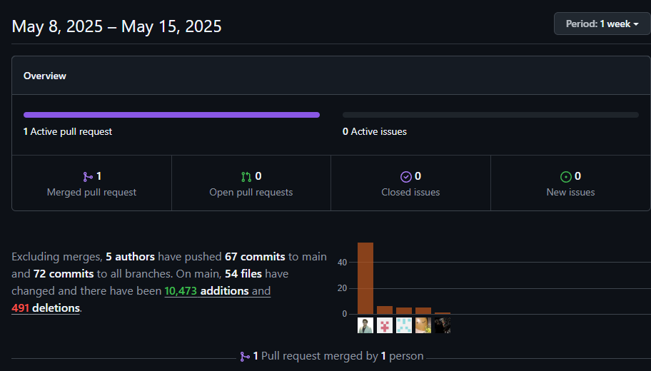


### 5.2.3 Sprint 3

#### 5.2.3.1. Spring Planning 3

En el Sprint Planning 3, se llevó a cabo una sesión de planificación para la elaboración del backend de la aplicación **TocaAquí**. A continuación, se presentan los detalles de la reunión:


| **Sprint #**                    | Sprint 3                                                                                           |
|--------------------------------|-----------------------------------------------------------------------------------------------------|
| **Sprint Planning Background** |                                                                                                     |
| **Date**                       | 2025-06-20                                                                                          |
| **Time**                       | 07:30 PM                                                                                            |
| **Location**                   | Google Meet (Reunión virtual)                                                                       |
| **Prepared By**                | Juan Paul Llamccaya Arone                                                                           |
| **Attendees**                  | Juan Paul Llamccaya / Oscar Antayhua / Diego Cabrera / Nelson Pereira / Eddo Su Caletti            |
| **Sprint 2 – Review Summary**  | Durante el Sprint 2 se logró completar la integración de los primeros controladores y modelos para los módulos base de autenticación (IAM) y evaluaciones. Se recibieron comentarios positivos del equipo respecto a la estructura del proyecto y se validó el uso de agregados y comandos. El Product Owner resaltó la correcta separación de capas y recomendó priorizar endpoints de eventos para el siguiente ciclo. |
| **Sprint 2 – Retrospective Summary** | El equipo manifestó satisfacción con la organización modular del backend, pero también se mencionó la necesidad de mejorar la documentación de endpoints y pruebas automatizadas. Se destacó como acierto el uso de reuniones de sincronización interdiarias y como mejora pendiente la asignación anticipada de tareas para facilitar paralelización del trabajo. |
| **Sprint Goal & User Stories** |                                                                                                     |
| **Sprint 3 Goal**              | Implementar y desplegar funcionalidades CRUD para Evaluaciones, IAM, Perfiles y Eventos en el backend de TocaAquí. |
| **Sprint 3 Velocity**          | 60 Story Points                                                                                     |
| **Sum of Story Points**        | 4 + 3 + 2 + 3 + 2 + 2 + 3 + 3 + 2 + 3 + 2 + 2 + 5 + 6 + 3 + 2 = **47**                                |


#### 5.2.3.2. Aspect Leaders and Collaborators

En el Sprint 3, los principales aspectos considerados fueron la autenticación y gestión de usuarios (IAM), la gestión de eventos y postulaciones (Events), y la infraestructura compartida (Shared). A continuación, se presenta la matriz de liderazgo y colaboración del equipo para cada aspecto:

| Team Member (Last Name, First Name)      | GitHub Username         | IAM (Auth & Users) | Events (Gestión de eventos) | Shared (Infraestructura) |
|------------------------------------------|------------------------|--------------------|----------------------------|-------------------------|
| Pereira, Fabrizzio                       | fabrizzoper            | L                  | C                          | L                       |
| Antayhua Castillo, Oscar Josué           | OscarAntayhuaCastillo  | C                  | L                          | C                       |
| Su Caletti, Eddo                         | Asalreon520            | C                  | C                          | C                       |
| Llamccaya Arone, Juan Paul               | JuanPaulLla            | C                  | C                          | C                       |
| Cabrera, Diego                           | omele7                 | C                  | C                          | C                       |

L: Leader (Líder)  |  C: Collaborator (Colaborador)


#### 5.2.3.3. Sprint Backlog 3

**Objetivo del Sprint** 
El objetivo principal de este Sprint es consolidar y finalizar las funcionalidades clave del backend de la plataforma TocaAquí, permitiendo a artistas y promotores gestionar eventos, postulaciones, invitaciones y contratos digitales de manera segura y eficiente. Durante este Sprint, se han implementado y probado todos los flujos principales de registro, autenticación, gestión de eventos y notificaciones, asegurando una experiencia robusta y lista para integración con el frontend.

**Sprint Board**

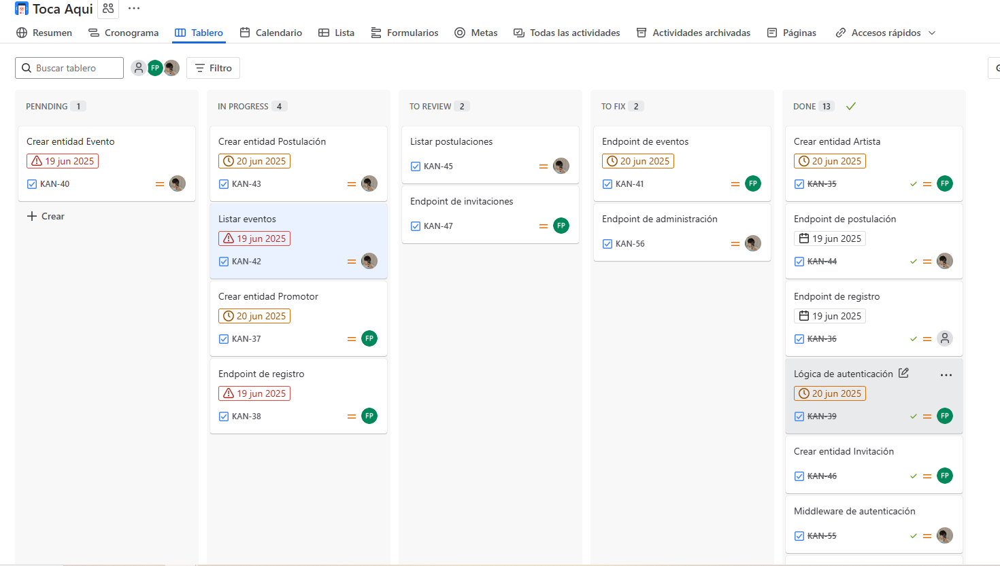
- **URL del Board:** [Enlace público a Jira](https://tocaqui.atlassian.net/jira/software/projects/KAN/list)

**Tabla de Control de Estado para el Sprint**

| User Story Id | User Story Title                                   | Task Id | Task Title                  | Description                                         | Estimation (Hours) | Assigned To         | Status |
|---------------|-----------------------------------------------------|---------|-----------------------------|-----------------------------------------------------|--------------------|---------------------|--------|
| US07          | Registro como artista en la plataforma              | T01     | Crear entidad Artista       | Implementar modelo y persistencia de artista        | 3                  | Fabrizzio Pereria   | Done   |
| US07          | Registro como artista en la plataforma              | T02     | Endpoint de registro        | Crear endpoint para registro de artista             | 2                  | Fabrizzio Pereria   | Done   |
| US14          | Registro como administrador de local                | T03     | Crear entidad Promotor      | Implementar modelo y persistencia de promotor       | 4                  | Fabrizzio Pereria   | Done   |
| US14          | Registro como administrador de local                | T04     | Endpoint de registro        | Crear endpoint para registro de promotor            | 2                  | Fabrizzio Pereria   | Done   |
| TS02          | Inicio de sesión mediante RESTful API               | T05     | Lógica de autenticación     | Implementar login y generación de token             | 3                  | Fabrizzio Pereria   | Done   |
| US16          | Publicación de eventos musicales                    | T06     | Crear entidad Evento        | Implementar modelo y persistencia de evento         | 2                  | Oscar Antayhua      | Done   |
| US16          | Publicación de eventos musicales                    | T07     | Endpoint de eventos         | Crear endpoint para crear y actualizar eventos      | 4                  | Oscar Antayhua      | Done   |
| US09          | Búsqueda de eventos compatibles con mi perfil       | T08     | Listar eventos              | Endpoint para listar eventos disponibles            | 2                  | Oscar Antayhua      | Done   |
| US10          | Postulación rápida a un evento desde la plataforma  | T09     | Crear entidad Postulación   | Implementar modelo y persistencia de postulación    | 3                  | Oscar Antayhua      | Done   |
| US10          | Postulación rápida a un evento desde la plataforma  | T10     | Endpoint de postulación     | Crear endpoint para postularse a eventos            | 2                  | Oscar Antayhua      | Done   |
| US17          | Revisión de postulaciones y selección de artista    | T11     | Listar postulaciones        | Endpoint para listar postulaciones de un evento     | 2                  | Oscar Antayhua      | Done   |
| US15          | Gestión de postulaciones e invitaciones             | T12     | Crear entidad Invitación    | Implementar modelo y persistencia de invitación     | 3                  | Oscar Antayhua      | Done   |
| US15          | Gestión de postulaciones e invitaciones             | T13     | Endpoint de invitaciones    | Crear endpoint para enviar invitaciones             | 2                  | Oscar Antayhua      | Done   |
| US12          | Subida y validación del rider técnico               | T14     | Crear entidad Contrato      | Implementar modelo y persistencia de contrato       | 4                  | Oscar Antayhua      | Done   |
| US12          | Subida y validación del rider técnico               | T15     | Endpoint de contratos       | Crear endpoint para firmar contratos digitales      | 2                  | Oscar Antayhua      | Done   |
| US18          | Validación del rider técnico enviado por artista    | T16     | Lógica de notificaciones    | Implementar lógica para notificar cambios de estado | 2                  | Fabrizzio Pereria   | Done   |
| US14          | Registro como administrador de local                | T17     | Endpoint de historial       | Crear endpoint para ver historial de eventos        | 3                  | Oscar Antayhua      | Done   |
| US15          | Gestión de postulaciones e invitaciones             | T18     | Lógica de invitaciones      | Implementar lógica para aceptar/rechazar invitaciones| 2                 | Oscar Antayhua      | Done   |
| US13          | Visualización de pagos recibidos y pendientes       | T19     | Endpoint de contratos firmados| Crear endpoint para listar contratos firmados    | 2                  | Oscar Antayhua      | Done   |
| TS01          | Registro de usuario (artista o promotor) a través de un RESTful API | T20     | Middleware de autenticación | Proteger endpoints con validación de token          | 3                  | Fabrizzio Pereria   | Done   |
| US08          | Acceso al dashboard personalizado de artista        | T21     | Endpoint de administración  | Crear endpoint para listar usuarios y eventos       | 2                  | Fabrizzio Pereria   | Done   |


#### 5.3.3.4. Development Evidence for Sprint Review

Durante el Sprint 3 se lograron avances significativos en la implementación del backend de la plataforma, completando los módulos de autenticación, gestión de usuarios, eventos, postulaciones, invitaciones y contratos digitales. A continuación, se presenta la evidencia de los commits realizados, que reflejan el trabajo colaborativo y el cumplimiento de los objetivos planteados para este ciclo.

| Repository                  | Branch                        | Commit Id | Commit Message           | Commit Message Body                | Commited on (Date) |
|-----------------------------|-------------------------------|-----------|-------------------------|------------------------------------|--------------------|
| CODENINJAS.TocaAqui.API/IAM | feature/IAM                   | 8298342   | merge (IAM)             | merged and fixed IAM bounded       | 2025-06-16         |
| CODENINJAS.TocaAqui.API     | develop, origin/develop       | 0accbce   | feat(program)           | fixed create database              | 2025-06-16         |
| CODENINJAS.TocaAqui.API     |                               | 795d8c0   | feat(program)           | fixed                              | 2025-06-16         |
| CODENINJAS.TocaAqui.API     | origin/feature/events         | 8298342   | merge (IAM)             | merged and fixed IAM bounded       | 2025-06-16         |
| CODENINJAS.TocaAqui.API     |                               | 26d8eee   | refactor(evets)         | refactored all bounded             | 2025-06-16         |
| CODENINJAS.TocaAqui.API     |                               | ae16b09   | refactor(events)        | refactored events bounded          | 2025-06-12         |
| CODENINJAS.TocaAqui.API     | origin/main, origin/HEAD, main| d070413   | refactor(http)          | refactored                         | 2025-06-11         |
| CODENINJAS.TocaAqui.API     |                               | 51c80ed   | feat(http)              | added http                         | 2025-06-11         |
| CODENINJAS.TocaAqui.API     |                               | 4eb111a   | feat(net8)              | eliminate unuse sln                | 2025-06-11         |
| CODENINJAS.TocaAqui.API     |                               | 4489ec7   | feat(sln)               | eliminate unuse sln                | 2025-06-11         |
| CODENINJAS.TocaAqui.API     |                               | 52cfd89   | refactor(name)          | named for the api refactored        | 2025-06-11         |

#### 5.2.3.5. Execution Evidence for Sprint Review


En este Sprint se ha completado exitosamente la implementación y documentación de la **API REST TocaAqui**, logrando un sistema robusto y completamente funcional para la gestión de eventos musicales. Los principales hitos alcanzados incluyen:

****Logros Técnicos Principales:****

- **API REST Completa:** Implementación de 25+ endpoints distribuidos en 5 módulos principales
- **Documentación OpenAPI:** Integración completa de Swagger/OpenAPI con anotaciones detalladas
- **Arquitectura DDD:** Implementación de Domain-Driven Design con separación clara de capas
- **Autenticación JWT:** Sistema de autenticación y autorización completamente funcional
- **Base de Datos:** Estructura de datos MySQL con Entity Framework Core
- **CORS Configuration:** Configuración para integración con frontend
- **Swagger en Producción:** Documentación accesible en ambiente de producción

**Screenshots de las Principales Vistas Implementadas**

**Vista de Documentación Swagger**

La documentación interactiva de la API está completamente implementada y accesible tanto en desarrollo como en producción:

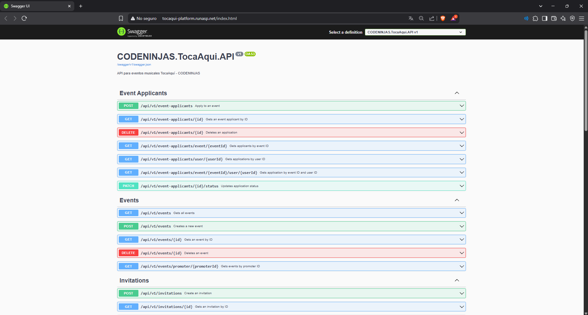


**Estructura de Base de Datos**

La base de datos MySQL ha sido implementada siguiendo las mejores prácticas de diseño, con tablas normalizadas y relaciones bien definidas:


#### 5.2.3.6. Services Documentation Evidence for Sprint Review

**Documentación de Web Services - API TocaAqui**

**Introducción**

En este Sprint se ha logrado implementar y documentar completamente la API REST de TocaAqui utilizando OpenAPI/Swagger. La API incluye endpoints para la gestión de eventos musicales, usuarios/autenticación, aplicaciones a eventos, invitaciones y pagos. Todos los endpoints están documentados con anotaciones Swagger y están disponibles tanto en desarrollo como en producción.

**URL del Repositorio y Commits**

- **Repositorio:** `CODENINJAS.TocaAqui.API`
- **Branch:** `feature/develop`
- **Commits relacionados con documentación:**
  - Implementación de Swagger y documentación OpenAPI
  - Habilitación de Swagger en producción
  - Configuración de anotaciones SwaggerOperation

**Tabla de Endpoints Documentados**

| Módulo | Endpoint | Verbo HTTP | Descripción | Parámetros | Autenticación |
|--------|----------|------------|-------------|------------|---------------|
| **IAM** | `/api/v1/users/sign-up` | POST | Registro de usuario | Body: RegisterUserResource | No |
| **IAM** | `/api/v1/users/sign-in` | POST | Inicio de sesión | Body: LoginUserResource | No |
| **IAM** | `/api/v1/users` | GET | Obtener todos los usuarios | - | Sí |
| **IAM** | `/api/v1/users/{id}` | GET | Obtener usuario por ID | Path: id (int) | Sí |
| **Events** | `/api/v1/events` | GET | Obtener todos los eventos | - | No |
| **Events** | `/api/v1/events/{id}` | GET | Obtener evento por ID | Path: id (int) | No |
| **Events** | `/api/v1/events/promoter/{promoterId}` | GET | Eventos por promotor | Path: promoterId (int) | No |
| **Events** | `/api/v1/events` | POST | Crear evento | Body: CreateEventResource | No |
| **Events** | `/api/v1/events/{id}` | DELETE | Eliminar evento | Path: id (int) | No |
| **Event Applicants** | `/api/v1/eventapplicants` | POST | Aplicar a evento | Body: CreateEventApplicantResource | No |
| **Event Applicants** | `/api/v1/eventapplicants/{id}` | GET | Obtener aplicación por ID | Path: id (int) | No |
| **Event Applicants** | `/api/v1/eventapplicants/event/{eventId}` | GET | Aplicaciones por evento | Path: eventId (int) | No |
| **Event Applicants** | `/api/v1/eventapplicants/user/{userId}` | GET | Aplicaciones por usuario | Path: userId (int) | No |
| **Event Applicants** | `/api/v1/eventapplicants/event/{eventId}/user/{userId}` | GET | Aplicación específica | Path: eventId, userId (int) | No |
| **Event Applicants** | `/api/v1/eventapplicants/{id}/status` | PATCH | Actualizar estado aplicación | Path: id (int), Body: UpdateEventApplicantStatusResource | No |
| **Event Applicants** | `/api/v1/eventapplicants/{id}` | DELETE | Eliminar aplicación | Path: id (int) | No |
| **Invitations** | `/api/v1/invitations` | POST | Crear invitación | Body: CreateInvitationResource | No |
| **Invitations** | `/api/v1/invitations/{id}` | GET | Obtener invitación por ID | Path: id (int) | No |
| **Invitations** | `/api/v1/invitations/event/{eventId}` | GET | Invitaciones por evento | Path: eventId (int) | No |
| **Invitations** | `/api/v1/invitations/artist/{artistId}` | GET | Invitaciones por artista | Path: artistId (int) | No |
| **Invitations** | `/api/v1/invitations/promoter/{promoterId}` | GET | Invitaciones por promotor | Path: promoterId (int) | No |
| **Invitations** | `/api/v1/invitations/{id}/respond` | PATCH | Responder invitación | Path: id (int), Body: UpdateEventApplicantStatusResource | No |
| **Invitations** | `/api/v1/invitations/{id}` | DELETE | Eliminar invitación | Path: id (int) | No |
| **Payments** | `/api/v1/payments` | POST | Crear pago | Body: CreatePaymentResource | No |
| **Payments** | `/api/v1/payments/{id}` | GET | Obtener pago por ID | Path: id (int) | No |
| **Payments** | `/api/v1/payments` | GET | Obtener todos los pagos | - | No |
| **Payments** | `/api/v1/payments/user/{userId}` | GET | Pagos por usuario | Path: userId (int), Query: userRole | No |
| **Payments** | `/api/v1/payments/{id}/status` | PATCH | Actualizar estado pago | Path: id (int), Body: UpdatePaymentStatusResource | No |

**Detalles de Endpoints por Módulo**

**1. Módulo IAM (Identity and Access Management)**

**POST `/api/v1/users/sign-up`**
**Descripción:** Registro de nuevo usuario en la plataforma

**Request Body:**
```json
{
  "name": "Juan Pérez",
  "email": "juan@ejemplo.com",
  "password": "password123",
  "role": "musico",
  "genre": "rock",
  "type": "banda",
  "description": "Banda de rock alternativo",
  "imageUrl": "https://ejemplo.com/imagen.jpg"
}
```

**Response (200):**
```json
{
  "message": "User created successfully"
}
```

**POST `/api/v1/users/sign-in`**
**Descripción:** Inicio de sesión de usuario

**Request Body:**
```json
{
  "email": "juan@ejemplo.com",
  "password": "password123"
}
```

**Response (200):**
```json
{
  "user": {
    "id": 1,
    "email": "juan@ejemplo.com",
    "name": "Juan Pérez",
    "role": "musico",
    "genre": "rock",
    "type": "banda",
    "description": "Banda de rock alternativo",
    "imageUrl": "https://ejemplo.com/imagen.jpg"
  },
  "token": "eyJhbGciOiJIUzI1NiIsInR5cCI6IkpXVCJ9..."
}
```

**2. Módulo Events**

**GET `/api/v1/events`**
**Descripción:** Obtiene todos los eventos disponibles

**Response (200):**
```json
[
  {
    "id": 1,
    "promoterId": 2,
    "name": "Concierto de Rock",
    "date": "2024-12-15T20:00:00Z",
    "time": "20:00",
    "location": "Teatro Nacional",
    "status": "published",
    "capacity": 500,
    "payment": 1500.00,
    "genre": "rock",
    "description": "Gran concierto de rock"
  }
]
```

**POST `/api/v1/events`**
**Descripción:** Crea un nuevo evento

**Request Body:**
```json
{
  "promoterId": 2,
  "name": "Concierto Jazz",
  "date": "2024-12-20T19:00:00Z",
  "time": "19:00",
  "publishDate": "2024-11-15T10:00:00Z",
  "location": "Club de Jazz",
  "imageUrl": "https://ejemplo.com/jazz.jpg",
  "status": "draft",
  "capacity": 200,
  "adminName": "Carlos Admin",
  "adminContact": "carlos@ejemplo.com",
  "requirements": "Instrumentos propios",
  "description": "Noche de jazz íntimo",
  "payment": 800.00,
  "duration": 120,
  "genre": "jazz",
  "equipment": "Sistema de sonido incluido"
}
```

**3. Módulo Payments**

**POST `/api/v1/payments`**
**Descripción:** Crea un nuevo pago

**Request Body:**
```json
{
  "eventId": 1,
  "musicianId": 3,
  "promoterId": 2,
  "amount": 1500.00,
  "paymentMethod": "bank_transfer",
  "bankAccountNumber": "1234567890",
  "bankName": "Banco de Crédito",
  "accountType": "savings",
  "description": "Pago por presentación en evento"
}
```

**Response (201):**
```json
{
  "id": 1,
  "eventId": 1,
  "musicianId": 3,
  "promoterId": 2,
  "amount": 1500.00,
  "currency": "PEN",
  "status": "Pending",
  "paymentMethod": "BankTransfer",
  "description": "Pago por presentación en evento",
  "createdAt": "2024-11-15T10:30:00Z",
  "updatedAt": "2024-11-15T10:30:00Z"
}
```

**PATCH `/api/v1/payments/{id}/status`** 
**Descripción:** Actualiza el estado de un pago

**Request Body:**
```json
{
  "status": "Completed",
  "comment": "Pago procesado exitosamente"
}
```

**Códigos de Respuesta HTTP**

| Código | Descripción |
|--------|-------------|
| 200 | OK - Operación exitosa |
| 201 | Created - Recurso creado exitosamente |
| 400 | Bad Request - Error en los datos enviados |
| 401 | Unauthorized - No autorizado |
| 404 | Not Found - Recurso no encontrado |
| 500 | Internal Server Error - Error interno del servidor |

**Configuración de Swagger**

La documentación Swagger está disponible en:
- **Desarrollo:** `https://localhost:7000/`
- **Producción:** `http://tocaqui-platform.runasp.net/index.html/`

**Configuración en Program.cs**
```csharp
// Swagger habilitado también en producción
app.UseSwagger();
app.UseSwaggerUI(ui =>
{
    ui.SwaggerEndpoint("/swagger/v1/swagger.json", "CODENINJAS.TocaAqui.API v1");
    ui.RoutePrefix = string.Empty;
});
```
**Autenticación JWT**

Los endpoints marcados con "Sí" en autenticación requieren el header:
```
Authorization: Bearer [JWT_TOKEN]
```

El token se obtiene mediante el endpoint `/api/v1/users/sign-in`.

#### 5.2.3.7. Software Deployment Evidence for Sprint Review

A continuación, se detalla la configuración para el despliegue de cada componente de la solución, especificando los pasos requeridos para que, partiendo de los repositorios de código fuente, se realice exitosamente la publicación de los productos digitales correspondientes, tales como la página de aterrizaje (Landing Page), los servicios web y las aplicaciones web del frontend.

Despliegue del Web Service:

Para el despliegue del Web Service, se utilizó la plataforma MonsterASP

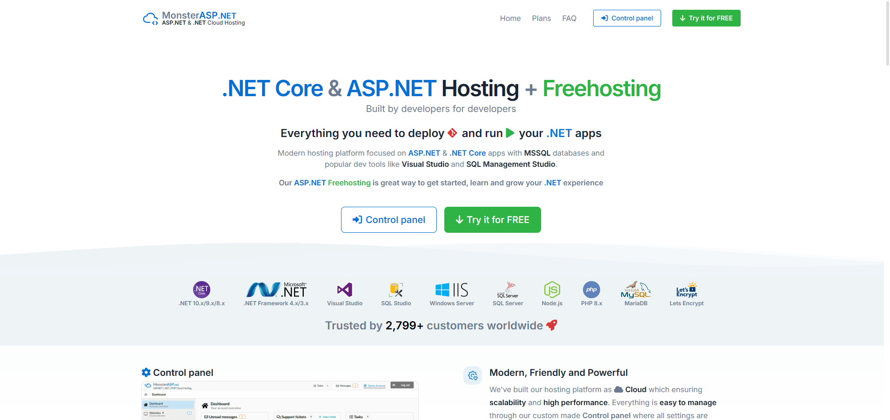

1-. Primero debemos de registrarnos para hacer uso de la plataforma.

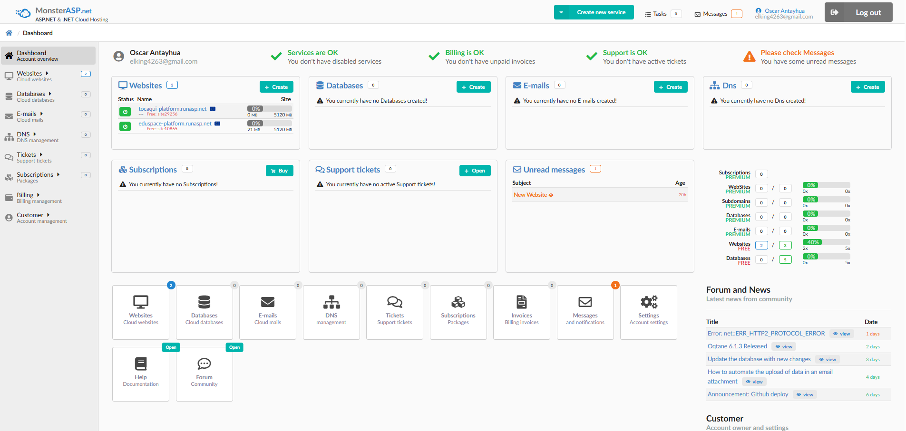

2-. Una vez ingresados creamos un nuevo website.

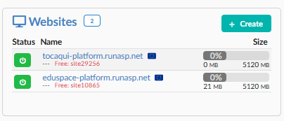

3-. Luego en el panel de control, nos dirigimos al apartado deploy y en WebDeploy Access lo colocamos en "Enable" y descargarmos el perfil de publicación

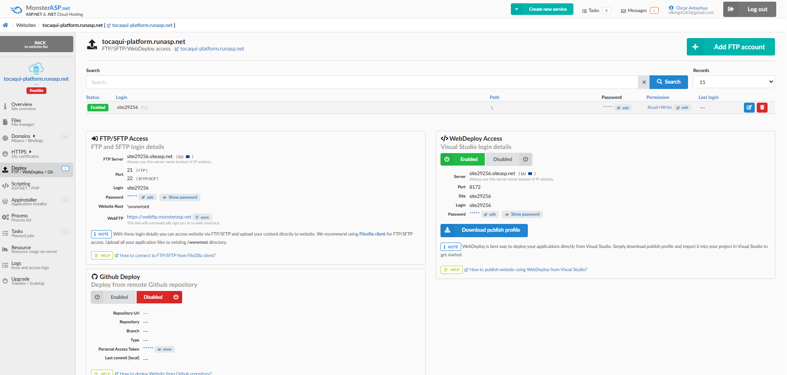


4-. Para utilizar el perfil debemos primero cargar nuestro proyecto dentro de Visual Studio, una vez cargado el proyecto, le damos click derecho sobre este y luego a "Publicar"

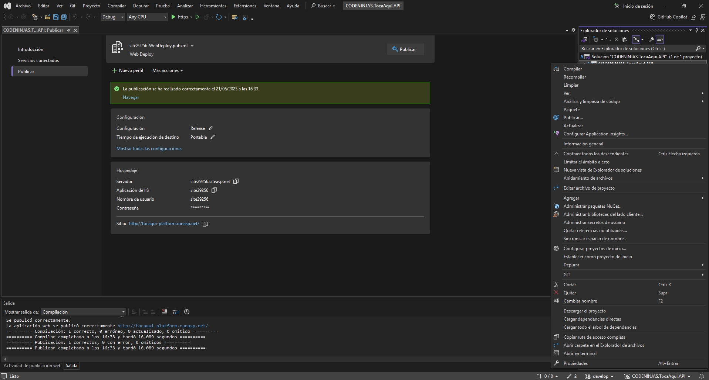

6-. Seleccionamos la opción de "Importar Pefil"

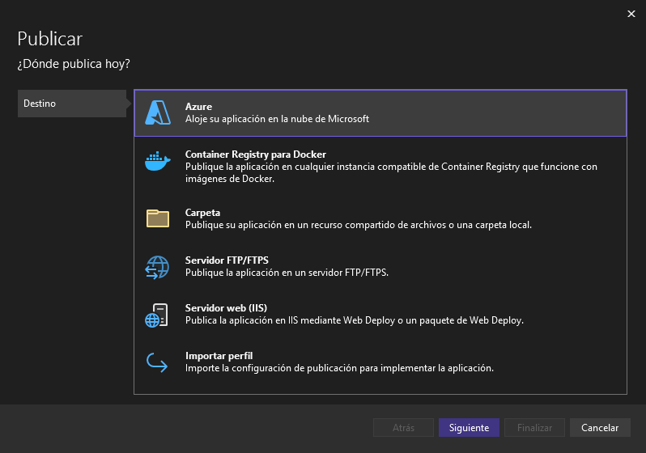

7-. Seleccionamos el perfil que descargamos en el panel de control de MonsterAsp"

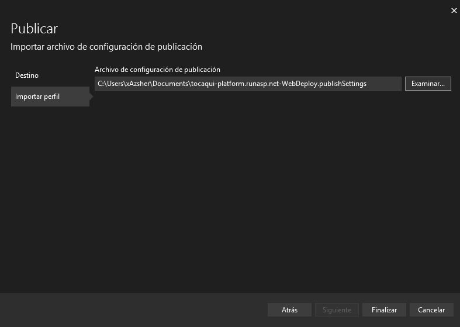

8-. Con esto ya tenemos desplegado nuestro Web Service


Link del Web Service desplegado: http://tocaqui-platform.runasp.net/index.html

#### 5.2.3.8. Team Collaboration Insights during Sprint

Para llevar a cabo los commits de nuestro Sprint, utilizamos las herramientas Rider y WebStorm, además de Git. Uno de los miembros del equipo efectuó un commit inicial para crear el repositorio; posteriormente, clonamos dicho repositorio mediante Git para trabajar localmente. A partir de ahí, realizamos las modificaciones necesarias en WebStorm o Rider, generamos las ramas correspondientes para cada cambio y, finalmente, efectuamos los commits, los cuales deben ser revisados dentro del repositorio en GitHub. Asimismo, empleamos Jira como herramienta de gestión para organizar y dar seguimiento a las tareas.

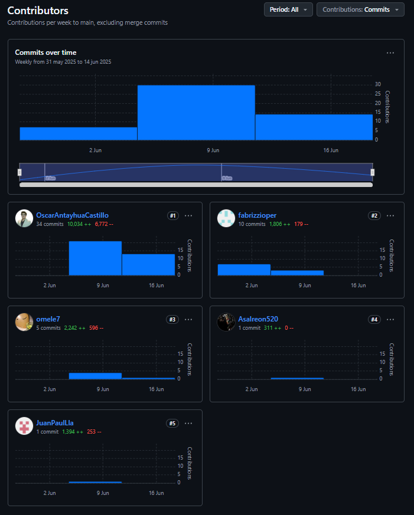
- **URL del Board:** [Enlace a Jira](https://tocaqui.atlassian.net/jira/software/projects/KAN/list)

### 5.2.4. Sprint 4
#### 5.2.4.1. Sprint Planning 4
| Sprint #                        | Sprint 4                                                                                           |
|---------------------------------|----------------------------------------------------------------------------------------------------|
| Sprint Planning Background      |                                                                                                    |
| Date                            | 2025-07-05                                                                                         |
| Time                            | 04:00 PM                                                                                           |
| Location                        | Google Meet (Reunión virtual)                                                                      |
| Prepared By                     | Nelson Fabrizzio Pereira Vasquez                                                                   |
| Attendees (to planning meeting) | Diego Ivan Cabrera Buitron / Juan Paul Llamccaya / Oscar Josué Antayhua Castillo / Nelson Fabrizzio Pereira Vasquez / Eddo Su Caletti |
| Sprint 3 – Review Summary       | En el Sprint 3 se implementaron y desplegaron funcionalidades CRUD para Evaluaciones, IAM, Perfiles y Eventos en el backend. Se mejoró la estructura modular y se avanzó en la documentación de endpoints. El Product Owner destacó la correcta separación de capas y la priorización de endpoints de eventos. |
| Sprint 3 – Retrospective Summary| El equipo valoró la organización modular y la mejora en la documentación, pero identificó la necesidad de fortalecer las pruebas automatizadas y la asignación anticipada de tareas. Se mantuvieron reuniones de sincronización frecuentes. |
| Sprint Goal & User Stories      |                                                                                                    |
| Sprint 4 Goal                   | El objetivo de este sprint es completar la documentación de la API REST utilizando Swagger/OpenAPI, implementar y validar los endpoints de pagos y eventos, mejorar la gestión de contratos y evaluaciones, realizar las correcciones correspondientes del sprint pasado y desplegar la base de datos en un servidor para que sea acsible desde cualquier maquina que requira hacer una cosulta. El sprint será exitoso cuando la base de datos esté correctamente desplegada, todos los endpoints estén documentados y funcionales, y se haya recibido feedback positivo en las pruebas internas. |
| Sprint 4 Velocity               | 40 Story Points                                                                                    |
| Sum of Story Points             | 38                                                                                                | 

#### 5.2.4.2. Aspect Leaders and Collaborators

En el Sprint 4, los principales aspectos considerados fueron:
- **IAM (Auth & Users):** Autenticación y gestión de usuarios.
- **Events (Gestión de eventos):** Implementación y validación de endpoints de eventos.
- **Payments (Pagos):** Implementación y validación de endpoints de pagos.
- **Shared (Infraestructura):** Infraestructura compartida, despliegue de base de datos y soporte transversal.

#### 5.2.4.2. Aspect Leaders and Collaborators

| Team Member (Last Name, First Name)      | GitHub Username         | IAM (Auth & Users) | Events (Gestión de eventos) | Payments (Pagos) | Shared (Infraestructura) |
|------------------------------------------|------------------------|--------------------|----------------------------|------------------|-------------------------|
| Pereira Vasquez, Nelson Fabrizzio        | fabrizzoper            | L                  | C                          | C                | C                       |
| Antayhua Castillo, Oscar Josué           | OscarAntayhuaCastillo  | C                  | L                          | C                | L                       |
| Su Caletti, Eddo                         | Asalreon520            | C                  | C                          | C                | C                       |
| Llamccaya Arone, Juan Paul               | JuanPaulLla            | C                  | C                          | C                | C                       |
| Cabrera Buitron, Diego Ivan              | omele7                 | C                  | C                          | L                | C                       |

**Leyenda:**  
L: Leader (Líder)  |  C: Collaborator (Colaborador)


#### 5.2.4.3. Sprint Backlog 4.
<table>
  <tr>
    <td> <strong>Sprint #</strong></td>
    <td colspan="7"> <strong>Sprint 1</strong> </td>
  </tr>

  <tr>
    <td colspan="2"> <strong>User Story</strong></td>
    <td colspan="6"> <strong>Work-item/Task</strong></td>
  </tr>
  <tr>
    <td> <strong>ID</strong> </td>
    <td> <strong>Title</strong></td>
    <td> <strong>ID</strong> </td>
    <td> <strong>Title</strong></td>
    <td> <strong>Description</strong></td>
    <td> <strong>Estimation (Hours)</strong></td>
    <td> <strong>Assigned To</strong></td>
    <td> <strong>Status</strong></td>
  </tr>

  <tr>
    <td rowspan="2">US20</td>
    <td rowspan="2">Evaluación post-show</td>
    <td>UT-001</td>
    <td>Entidad Evaluation</td>
    <td>Crear clase aggregate `Evaluation` con todos sus campos y constructor</td>
    <td rowspan="2">4</td>
    <td rowspan="2">Oscar Antayhua</td>
    <td rowspan="2">Done</td>
  </tr>
  <tr>
    <td>UT-002</td>
    <td>Enums de evaluación</td>
    <td>Crear enums `EEvaluationType` y `EEvaluationStatus`</td>
  </tr>

  <tr>
    <td>US08</td>
    <td>Dashboard de artista</td>
    <td>UT-003</td>
    <td>CommandService</td>
    <td>Implementar `EvaluationCommandService` con método para crear evaluaciones</td>
    <td>4</td>
    <td>Oscar Antayhua</td>
    <td>Done</td>
  </tr>

  <tr>
    <td>US29</td>
    <td>Calificaciones en panel</td>
    <td>UT-004</td>
    <td>QueryService</td>
    <td>Implementar `EvaluationQueryService` para obtener evaluaciones y promedios</td>
    <td>4</td>
    <td>Oscar Antayhua</td>
    <td>Done</td>
  </tr>

  <tr>
    <td>US33</td>
    <td>Visualización de pagos</td>
    <td>UT-005</td>
    <td>Repositorio Evaluation</td>
    <td>Crear `EvaluationRepository` con persistencia simulada</td>
    <td>4</td>
    <td>Oscar Antayhua</td>
    <td>Done</td>
  </tr>

  <tr>
    <td>US10</td>
    <td>Postulación a eventos</td>
    <td>UT-006</td>
    <td>Controlador Evaluations</td>
    <td>Implementar `EvaluationsController` con endpoints GET y POST</td>
    <td>4</td>
    <td>Oscar Antayhua</td>
    <td>Done</td>
  </tr>

  <tr>
    <td>US14</td>
    <td>Registro promotor/local</td>
    <td>UT-007</td>
    <td>DTO CreateEvaluation</td>
    <td>Crear recurso REST de entrada `CreateEvaluationResource`</td>
    <td>4</td>
    <td>Nelson Pereira</td>
    <td>Done</td>
  </tr>

  <tr>
    <td>US13</td>
    <td>Historial de pagos</td>
    <td>UT-008</td>
    <td>DTO EvaluationResource</td>
    <td>Crear recurso REST de salida `EvaluationResource`</td>
    <td>4</td>
    <td>Nelson Pereira</td>
    <td>Done</td>
  </tr>

  <tr>
    <td>US35</td>
    <td>Estado del contrato</td>
    <td>UT-009</td>
    <td>Assembler de evaluación</td>
    <td>Crear `EvaluationResourceFromEntityAssembler` para mapear entidad a recurso</td>
    <td>4</td>
    <td>Nelson Pereira</td>
    <td>Done</td>
  </tr>

  <tr>
    <td>US06</td>
    <td>Selección de tipo de usuario</td>
    <td>UT-010</td>
    <td>AppDbContext configurado</td>
    <td>Configurar `DbSet<Evaluation>` y conversiones JSON para checklist</td>
    <td>4</td>
    <td>Diego Cabrera</td>
    <td>Done</td>
  </tr>

  <tr>
    <td rowspan="2">US17</td>
    <td rowspan="2">Revisión de postulaciones</td>
    <td>UT-011</td>
    <td>Modificar controlador de invitaciones</td>
    <td>Validar entidades reales y crear comando completo</td>
    <td rowspan="2">8</td>
    <td rowspan="2">Oscar Antayhua</td>
    <td rowspan="2">Done</td>
  </tr>
  <tr>
    <td>UT-012</td>
    <td>Actualizar DTO de invitación</td>
    <td>Incluir nombres de artista, promotor y evento</td>
  </tr>

  <tr>
    <td>US15</td>
    <td>Dashboard del local</td>
    <td>UT-013</td>
    <td>Assembler de invitaciones</td>
    <td>Adaptar `InvitationResourceFromEntityAssembler` a nuevos campos</td>
    <td>4</td>
    <td>Diego Cabrera</td>
    <td>Done</td>
  </tr>

  <tr>
    <td>US32</td>
    <td>Inicio de sesión</td>
    <td>UT-015</td>
    <td>Actualizar cadena de conexión</td>
    <td>Modificar `appsettings.json` para usar base de datos Railway</td>
    <td>4</td>
    <td>Nelson Pereira</td>
    <td>Done</td>
  </tr>
</table>


#### 5.2.4.4. Development Evidence for Sprint Review

No hubierron cambios en el development a comparacaión del sprint 3.

#### 5.2.4.5. Execution Evidence for Sprint Review.

Se realizó correctamente el despliegue de la base de Datos

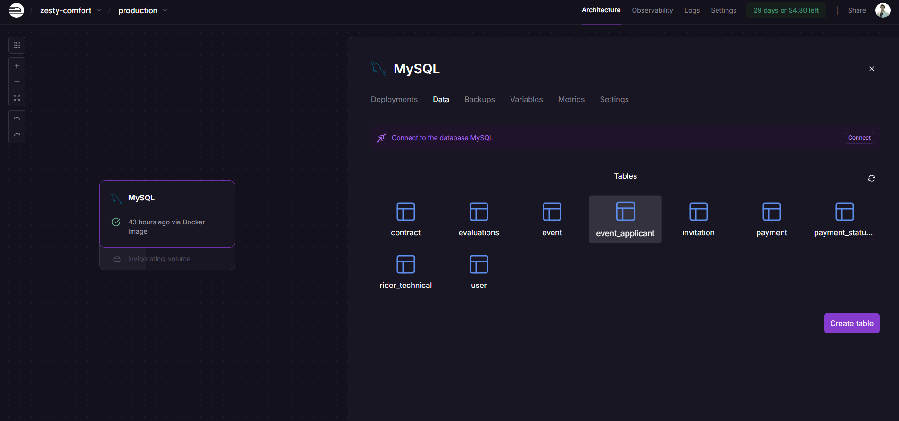


#### 5.2.4.6. Services Documentation Evidence for Sprint Review.
#### 5.2.4.7. Software Deployment Evidence for Sprint Review.

A continuación, se detalla la configuración para el despliegue de cada componente de la solución, especificando los pasos requeridos para que, partiendo de los repositorios de código fuente, se realice exitosamente la publicación de los productos digitales correspondientes, tales como la página de aterrizaje (Landing Page), los servicios web y las aplicaciones web del frontend.

Despliegue del Web Service:

Para el despliegue del Web Service, se utilizó la plataforma MonsterASP


1-. Primero debemos de registrarnos para hacer uso de la plataforma.


2-. Una vez ingresados creamos un nuevo website.


3-. Luego en el panel de control, nos dirigimos al apartado deploy y en WebDeploy Access lo colocamos en "Enable" y descargarmos el perfil de publicación


4-. Para utilizar el perfil debemos primero cargar nuestro proyecto dentro de Visual Studio, una vez cargado el proyecto, le damos click derecho sobre este y luego a "Publicar"


6-. Seleccionamos la opción de "Importar Pefil"


7-. Seleccionamos el perfil que descargamos en el panel de control de MonsterAsp"


8-. Con esto ya tenemos desplegado nuestro Web Service


Link del Web Service desplegado: http://tocaqui-platform.runasp.net/index.html


Para el lado de la base de datos, utilizamos Railway para el despliegue del mismo y lo conectado a nuestro back-end desplegado en Monster-ASP

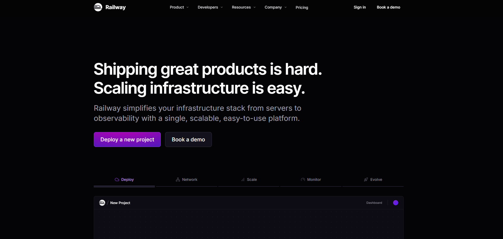

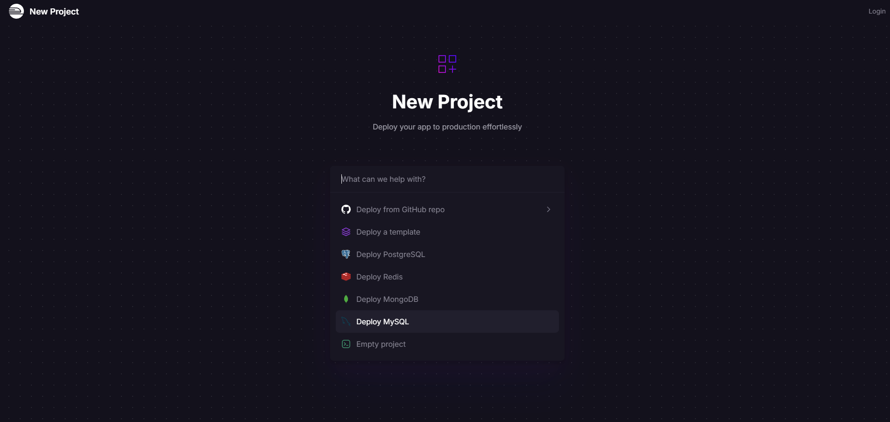

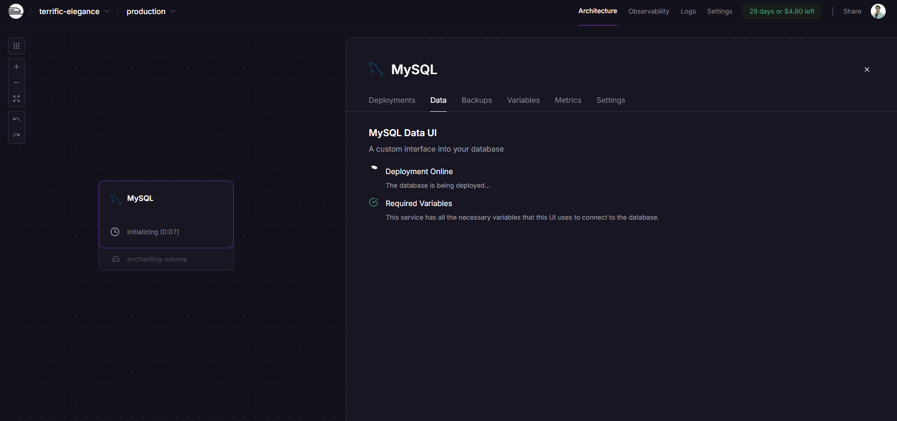


Para el lado del Front-End utilizamos Vercel para el despliegue del mismo.

- **Repositorio:** [Web Application](https://github.com/1ASI0730-2510-4370-G1-TocaAqui/Landing-Page)
- **URL de producción:** [https://tocaaqui-frontend.vercel.app/](https://tocaaqui-frontend.vercel.app/)
- **Branch desplegado:** `main`


#### 5.2.4.8. Team Collaboration Insights during Sprint.


- **URL del Board:** [Enlace a Jira](https://tocaqui.atlassian.net/jira/software/projects/KAN/list)


### 5.3 Validation Interviews
#### 5.3.1 Diseño de entrevistas

**Objetivo de la entrevista:**

Validar la usabilidad y efectividad de la landing page de TocaAquí y de los flujos de usuario (user flows) asegurando que cada flujo sea intuitivo, claro y funcional para los usuarios y su interaccion con la plataforma.


#### Saludo y presentación

Comenzamos con una introducción breve de los entrevistados para recordar quiénes son:

1. ¿Cómo se llama?
2. ¿Cuántos años tiene?
3. ¿En qué distrito vive?

#### Preguntas

Estas preguntas nos ayudarán a saber cuál es la experiencia de usuario, si nuestro producto llenó las expectativas del usuario, y también saber las posibles mejoras, comentarios y quejas sobre nuestro producto.

Promotor:

1. ¿Entendiste rápidamente el propósito de **TocaAquí** al ver la landing page?

2. ¿Te parece atractiva y clara la interfaz del sitio web?

3. ¿Qué tan útil te resulta poder filtrar músicos o espacios por ubicación y género musical?

4. ¿Contratarías (o te dejarías contratar) a través de una plataforma con contratos digitales?

5. ¿Te inspira confianza el uso de pagos seguros mediante **escrow**?

6. ¿Consideras útil tener una agenda digital y gestión logística dentro de la plataforma?

7. ¿Qué tan importante es para ti la promoción automática de eventos en redes o medios?

8. ¿Te parece relevante incluir evaluaciones post-evento para construir reputación?

9. ¿Crees que **TocaAquí** puede ayudar a profesionalizar el circuito musical independiente?

10. ¿Qué función agregarías o mejorarías en la plataforma para que se adapte mejor a tus necesidades?

Artista:

1. ¿Sientes que **TocaAquí** te ayuda a encontrar más oportunidades para tocar en vivo?

2. ¿Qué tan fácil te resulta registrarte y crear tu perfil como artista?

3. ¿Te parece útil tener un sistema donde los **venues** pueden contratarte directamente?

4. ¿Te genera confianza saber que los pagos son a través de un sistema **escrow**?

5. ¿Valoras tener contratos digitales para evitar malentendidos?

6. ¿Te resulta útil llevar una agenda digital con tus fechas confirmadas?

7. ¿Qué tan importante es para ti la posibilidad de recibir evaluaciones luego de tus presentaciones?

8. ¿Sientes que **TocaAquí** te brinda herramientas para profesionalizar tu carrera?

9. ¿Qué tanto valoras que **TocaAquí** promueva tus eventos automáticamente en redes o medios?

10. ¿Qué función agregarías o mejorarías para que se adapte mejor a tu trabajo como artista?
### 5.3.2. Registro de Entrevistas.
  
A continuación presentamos los resultados de las entrevistas de validación realizadas a los musicos independientes y promotores, nuestros segmentos objetivos.

### Segmento : Promotores
**Entrevista 1**    
<table border="1" cellspacing="0" cellpadding="8">
  <thead>
    <tr>
      <th><strong>Dato</strong></th>
      <th><strong>Información</strong></th>
    </tr>
  </thead>
  <tbody>
    <tr><td>Nombre completo</td><td>David Angel Fernandez Torres</td></tr>
    <tr><td>Edad</td><td>19 años</td></tr>
    <tr><td>Distrito</td><td>San Miguel</td></tr>
    <tr><td>Inicio de la entrevista</td><td>00:00</td></tr>
    <tr><td>Duración de la entrevista</td><td>16:01</td></tr>
    <tr><td>Foto captura</td><td></td></tr>
    <tr><td>Resumen</td><td>David se dio cuenta de que en Tocaaquí conecta a los músicos con los lugares y destaca su explicación e interfaz funcional. Las búsquedas filtran la ubicación y el género, los contratos digitales, los pagos seguros a través de la transacción y el programa de logística integrada. Para mejorar la reputación, considere automáticamente la promoción en redes y evaluaciones después de las cuentas. Él cree que la plataforma está profesionalizada por el esquema independiente y propone agregar eventos de cooperación e integración con WhatsApp o telegrama para facilitar el contro.</td></tr>  
  </tbody>
</table>
[upc-pre-202510-1asi0730-4370-tocaaqui-validation-sprint-3.mp4](https://upcedupe-my.sharepoint.com/:v:/g/personal/u20211b293_upc_edu_pe/ESylgHCxgspAoJeHo1y54aYB4YbwqzrMT2flqJ041k94DA?nav=eyJyZWZlcnJhbEluZm8iOnsicmVmZXJyYWxBcHAiOiJPbmVEcml2ZUZvckJ1c2luZXNzIiwicmVmZXJyYWxBcHBQbGF0Zm9ybSI6IldlYiIsInJlZmVycmFsTW9kZSI6InZpZXciLCJyZWZlcnJhbFZpZXciOiJNeUZpbGVzTGlua0NvcHkifX0&e=JqegTj)

**Entrevista 2**
<table border="1" cellspacing="0" cellpadding="8">
  <thead>
    <tr>
      <th><strong>Dato</strong></th>
      <th><strong>Información</strong></th>
    </tr>
  </thead>
  <tbody>
    <tr><td>Nombre completo</td><td>Diego Luis Ramirez Cerna</td></tr>
    <tr><td>Edad</td><td>20 años</td></tr>
    <tr><td>Distrito</td><td>Villa María del Triunfo</td></tr>
    <tr><td>Inicio de la entrevista</td><td>16:01</td></tr>
    <tr><td>Duración de la entrevista</td><td>19:11</td></tr>
    <tr><td>Foto captura</td><td></td></tr>
    <tr><td>Resumen</td><td>Diego Ramírez es administrador y productor de eventos en el club El Refugio de Villa Maria del Triunfo. Con más de diez años en la industria musical, comenta que desde que comenzó a usar TocaAquí ha optimizado mucho la gestión de shows y la contratación de artistas. Le resulta muy práctico el filtro por género y ubicación, que le permite encontrar bandas que encajan con la identidad del local. Destaca la confianza que le da el sistema de pagos escrow y la formalidad de los contratos digitales, que simplifican los procesos legales. La agenda digital integrada le ayuda a organizar fechas y coordinar la logística sin contratiempos. Además, la promoción automática de eventos en redes ha incrementado notablemente la asistencia. Como mejora, Diego propone implementar un chat directo para una comunicación más fluida con los músicos.</td>
  </tbody>
</table>
[upc-pre-202510-1asi0730-4370-tocaaqui-validation-sprint-3.mp4](https://upcedupe-my.sharepoint.com/:v:/g/personal/u20211b293_upc_edu_pe/ESylgHCxgspAoJeHo1y54aYB4YbwqzrMT2flqJ041k94DA?nav=eyJyZWZlcnJhbEluZm8iOnsicmVmZXJyYWxBcHAiOiJPbmVEcml2ZUZvckJ1c2luZXNzIiwicmVmZXJyYWxBcHBQbGF0Zm9ybSI6IldlYiIsInJlZmVycmFsTW9kZSI6InZpZXciLCJyZWZlcnJhbFZpZXciOiJNeUZpbGVzTGlua0NvcHkifX0&e=JqegTj)

**Entrevista 3**
<table border="1" cellspacing="0" cellpadding="8">
  <thead>
    <tr>
      <th><strong>Dato</strong></th>
      <th><strong>Información</strong></th>
    </tr>
  </thead>
  <tbody>
    <tr><td>Nombre completo</td><td>Andrea Elizabeth Santur Tello</td></tr>
    <tr><td>Edad</td><td>19 años</td></tr>
    <tr><td>Distrito</td><td>Los Olivos</td></tr>
    <tr><td>Inicio de la entrevista</td><td>19:11</td></tr>
    <tr><td>Duración de la entrevista</td><td>25:04</td></tr>
    <tr><td>Foto captura</td><td></td></tr>
    <tr><td>Resumen</td><td>Andrea apreció que nuestra plataforma se conectaba a los artistas y consideraba una interfaz clara y profesional. Destaca la utilidad de los filtros por ubicación y de género y evalúa los acuerdos digitales sobre su apoyo legal. Él confía completamente en los pagos con el acuerdo y está considerando mucho la agenda de logística integrada. Consulte la publicidad automática en redes y cuentas en cuentas si son objetivos. Él cree que la plataforma está profesionalizada por el esquema independiente y propone agregar estados financieros a los perfiles de eventos y equipos de colaboración.</td>
  </tbody>
</table>
[upc-pre-202510-1asi0730-4370-tocaaqui-validation-sprint-3.mp4](https://upcedupe-my.sharepoint.com/:v:/g/personal/u20211b293_upc_edu_pe/ESylgHCxgspAoJeHo1y54aYB4YbwqzrMT2flqJ041k94DA?nav=eyJyZWZlcnJhbEluZm8iOnsicmVmZXJyYWxBcHAiOiJPbmVEcml2ZUZvckJ1c2luZXNzIiwicmVmZXJyYWxBcHBQbGF0Zm9ybSI6IldlYiIsInJlZmVycmFsTW9kZSI6InZpZXciLCJyZWZlcnJhbFZpZXciOiJNeUZpbGVzTGlua0NvcHkifX0&e=JqegTj)

### Segmento : Artistas

**Entrevista 1** 

<table border="1" cellspacing="0" cellpadding="8">
  <thead>
    <tr>
      <th><strong>Dato</strong></th>
      <th><strong>Información</strong></th>
    </tr>
  </thead>
  <tbody>
    <tr><td>Nombre completo</td><td>Giancarlo Ventura Saldaña</td></tr>
    <tr><td>Edad</td><td>20 años</td></tr>
    <tr><td>Distrito</td><td>Surco</td></tr>
    <tr><td>Inicio de la entrevista</td><td>25:04</td></tr>
    <tr><td>Duración de la entrevista</td><td>30:17</td></tr>
    <tr><td>Foto captura</td><td></td></tr>
    <tr><td>Resumen</td><td>Giancarlo es músico independiente, vocalista y guitarrista de una banda de rock alternativo radicada en Miraflores. Con más de 6 años en la escena local, suele presentarse varias veces al mes en bares, eventos culturales y festivales pequeños. Aunque ha logrado establecer contactos por redes sociales, siente que el proceso de gestión sigue siendo muy informal: falta de acuerdos claros, pagos inciertos y poca organización en la logística. Por eso valora que plataformas como TocaAquí ofrezcan contratos digitales, seguridad en los pagos mediante escrow y una agenda profesional que le permita enfocarse en lo creativo sin preocuparse por los detalles administrativos.</td>
  </tbody>
</table>
[upc-pre-202510-1asi0730-4370-tocaaqui-validation-sprint-3.mp4](https://upcedupe-my.sharepoint.com/:v:/g/personal/u20211b293_upc_edu_pe/ESylgHCxgspAoJeHo1y54aYB4YbwqzrMT2flqJ041k94DA?nav=eyJyZWZlcnJhbEluZm8iOnsicmVmZXJyYWxBcHAiOiJPbmVEcml2ZUZvckJ1c2luZXNzIiwicmVmZXJyYWxBcHBQbGF0Zm9ybSI6IldlYiIsInJlZmVycmFsTW9kZSI6InZpZXciLCJyZWZlcnJhbFZpZXciOiJNeUZpbGVzTGlua0NvcHkifX0&e=JqegTj)

**Entrevista 2**
<table border="1" cellspacing="0" cellpadding="8">
  <thead>
    <tr>
      <th><strong>Dato</strong></th>
      <th><strong>Información</strong></th>
    </tr>
  </thead>
  <tbody>
    <tr><td>Nombre completo</td><td>Carlos Gonsales Meneses</td></tr>
    <tr><td>Edad</td><td>23 años</td></tr>
    <tr><td>Distrito</td><td>Los Olivos</td></tr>
    <tr><td>Inicio de la entrevista</td><td>30:17</td></tr>
    <tr><td>Duración de la entrevista</td><td>35:06</td></tr>
    <tr><td>Foto captura</td><td></td></tr>
    <tr><td>Resumen</td><td>Carlos Gonsales es guitarrista y vocalista de una banda de rock alternativo con base en Miraflores. Con seis años en la escena local, ha recorrido bares y festivales del circuito independiente. Desde que se unió a TocaAquí, siente que sus oportunidades para tocar en vivo han aumentado notablemente. Destaca lo simple que fue crear su perfil y lo útil que resulta recibir propuestas directas de los venues. Le da confianza saber que los pagos están asegurados por escrow y que puede formalizar sus presentaciones con contratos digitales. También valora la agenda integrada para organizar sus fechas, y siente que las evaluaciones y la difusión automática de sus shows han mejorado su imagen profesional. Para él, una función para conectar con otros músicos y acceder a estadísticas sería el siguiente paso ideal.</td></tr>
  </tbody>
</table>
[upc-pre-202510-1asi0730-4370-tocaaqui-validation-sprint-3.mp4](https://upcedupe-my.sharepoint.com/:v:/g/personal/u20211b293_upc_edu_pe/ESylgHCxgspAoJeHo1y54aYB4YbwqzrMT2flqJ041k94DA?nav=eyJyZWZlcnJhbEluZm8iOnsicmVmZXJyYWxBcHAiOiJPbmVEcml2ZUZvckJ1c2luZXNzIiwicmVmZXJyYWxBcHBQbGF0Zm9ybSI6IldlYiIsInJlZmVycmFsTW9kZSI6InZpZXciLCJyZWZlcnJhbFZpZXciOiJNeUZpbGVzTGlua0NvcHkifX0&e=JqegTj)

**Entrevista 3**
<table border="1" cellspacing="0" cellpadding="8">
  <thead>
    <tr>
      <th><strong>Dato</strong></th>
      <th><strong>Información</strong></th>
    </tr>
  </thead>
  <tbody>
    <tr><td>Nombre completo</td><td>Juan Pablo Torres Solis</td></tr>
    <tr><td>Edad</td><td>25 años</td></tr>
    <tr><td>Distrito</td><td>Molino</td></tr>
    <tr><td>Inicio de la entrevista</td><td>35:06</td></tr>
    <tr><td>Duración de la entrevista</td><td>37:43</td></tr>
    <tr><td>Foto captura</td><td></td></tr>
    <tr><td>Resumen</td><td>Juan Pablo Torres es guitarrista y vocalista de una banda de indie rock con base en Barranco. Con varios años de experiencia en la escena local, ha notado que desde que se unió a TocaAquí sus oportunidades para tocar en vivo han aumentado considerablemente. Destaca lo sencillo que fue registrarse y crear su perfil, así como la utilidad de recibir propuestas directas de los venues. Le da confianza el sistema de pagos mediante escrow y la formalidad que ofrecen los contratos digitales. Además, valora mucho la agenda digital integrada para organizar sus fechas y la posibilidad de recibir evaluaciones que le ayudan a mejorar y construir su reputación. También aprecia la promoción automática de sus eventos en redes sociales, que ha ampliado su público. Como sugerencia, le gustaría que la plataforma incluyera una función para conectar con otros músicos y acceder a estadísticas detalladas sobre sus presentaciones.</td></tr>
  </tbody>
</table>
[upc-pre-202510-1asi0730-4370-tocaaqui-validation-sprint-3.mp4](https://upcedupe-my.sharepoint.com/:v:/g/personal/u20211b293_upc_edu_pe/ESylgHCxgspAoJeHo1y54aYB4YbwqzrMT2flqJ041k94DA?nav=eyJyZWZlcnJhbEluZm8iOnsicmVmZXJyYWxBcHAiOiJPbmVEcml2ZUZvckJ1c2luZXNzIiwicmVmZXJyYWxBcHBQbGF0Zm9ybSI6IldlYiIsInJlZmVycmFsTW9kZSI6InZpZXciLCJyZWZlcnJhbFZpZXciOiJNeUZpbGVzTGlua0NvcHkifX0&e=JqegTj)

### 5.3.3. Evaluaciones según herurísticas.

**UX Heuristics & Principles Evaluation**
**Usability – Inclusive Design – Information Architecture**

**CARRERA**: Ingeniería de Software  
**CURSO**: Desarrollo de Aplicaciones Open Source  
**SECCIÓN**: [4334]  
**PROFESORES**: Todos  
**AUDITOR**: Grupo TocaAquí  
**CLIENTE(S)**: Todos

**SITE o APP A EVALUAR**: TocaAquí 

**TAREAS A EVALUAR**

1. Visualización de beneficios y funcionalidades de la plataforma
2. Acceso a la sección de contacto
3. Navegación desde el menú
4. Acceso a los botones de registro por tipo de usuario
5. Cambio de idioma
6. Visualización de testimonios u opiniones


**EVALUACIÓN SEGÚN HEURÍSTICAS**

| # | Heurística | Observación | Severidad (0-4) | Recomendación |
|---|------------|-------------|----------------|---------------|
| 1 | Visibilidad del estado del sistema | No hay indicador visual que confirme que se ha accedido a una sección distinta (por ejemplo, About o Contacto). | 2 | Añadir efectos de scroll o resaltado del menú activo. |
| 2 | Correspondencia entre el sistema y el mundo real | El lenguaje utilizado en botones es claro y amigable ("Únete como artista/promotor"). | 0 | Ninguna. Excelente elección de lenguaje. |
| 3 | Control y libertad del usuario | No hay opción para retroceder fácilmente a la parte superior desde secciones inferiores. | 1 | Añadir un botón “Volver arriba” o scroll automático al hacer clic en el logo. |
| 4 | Consistencia y estándares | Buen uso de íconos y colores consistentes en toda la página. | 0 | Ninguna. |
| 5 | Reconocimiento antes que recuerdo | Secciones como “Equipo” y “Beneficios” están claramente rotuladas. | 0 | Ninguna. |
| 6 | Flexibilidad y eficiencia de uso | El sitio está adaptado a dispositivos móviles (responsive). | 1 | Optimizar el menú para que sea tipo "hamburguesa" en móvil. |
| 7 | Diseño estético y minimalista | El diseño es limpio y moderno, no sobrecarga al usuario. | 0 | Ninguna. |
| 8 | Ayuda y documentación | No hay sección de ayuda visible o guía para nuevos usuarios. | 2 | Incluir una sección tipo “¿Cómo funciona?” con pasos o video explicativo.. |

