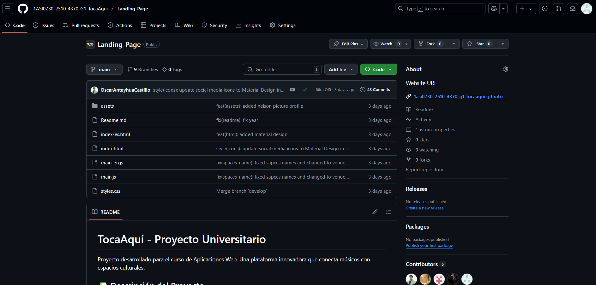
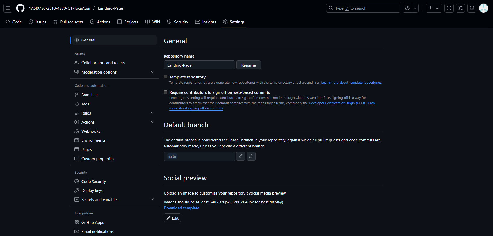
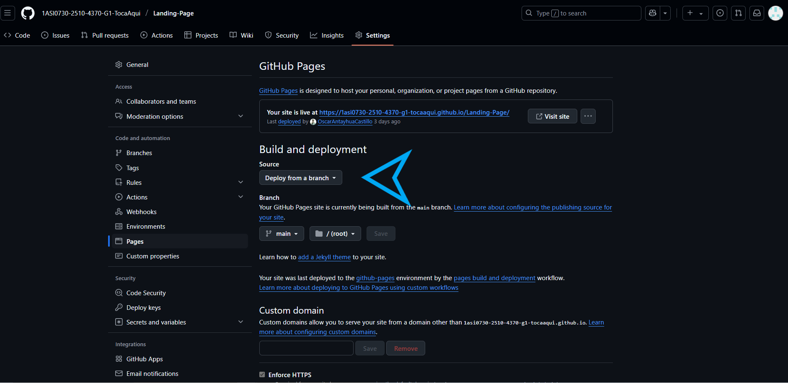
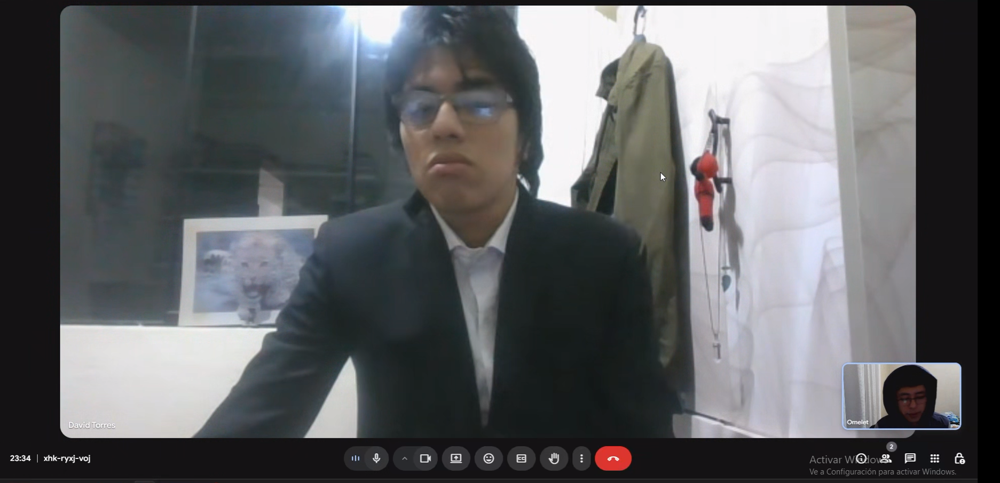
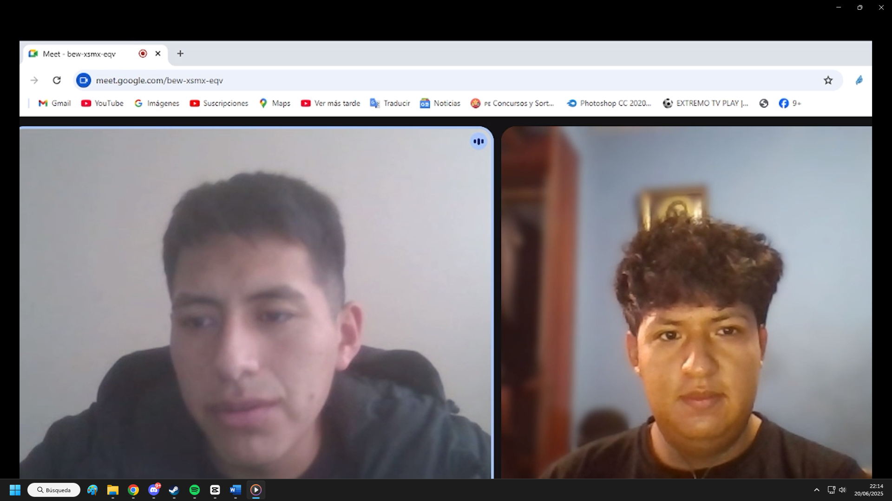
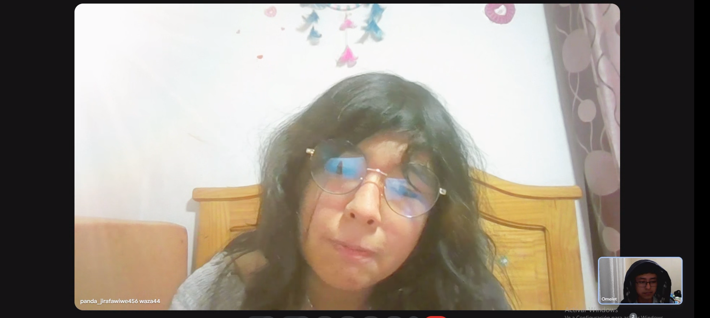
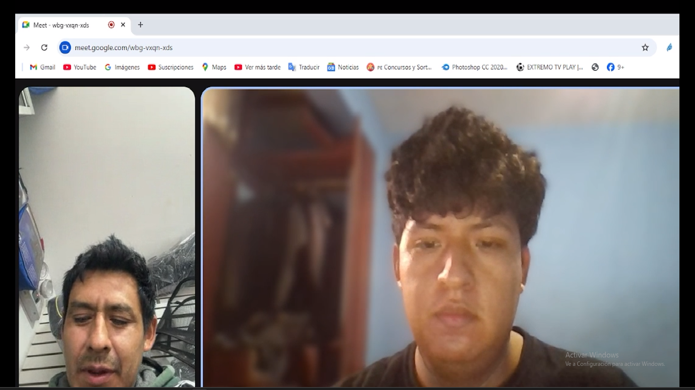

# Capítulo V: Product Implementation, Validation & Deployment

## 5.1. Software Configuration Management

### 5.1.1. Software Development Environment Configuration

#### Requirements Management

**Jira**: Herramienta de gestión ágil utilizada para organizar y monitorear las tareas del proyecto. Cada actividad fue registrada con una clave única y se asignó a miembros responsables, permitiendo controlar el avance por capítulo.  
Ruta de referencia: [https://www.atlassian.com/software/jira](https://www.atlassian.com/software/jira)

#### Product UX/UI Design

**Figma**: Plataforma online empleada para crear diseños visuales y prototipos navegables tanto para escritorio como dispositivos móvilxes. Fue esencial en la definición de la experiencia de usuario del landing.  
Ruta de referencia: [https://www.figma.com](https://www.figma.com)

#### Software Development

**Visual Studio Code**: Editor de texto utilizado por todos los miembros del equipo, elegido por su ligereza, compatibilidad con múltiples lenguajes y sus extensiones útiles para desarrollo web y control de versiones.  
Ruta de referencia: [https://code.visualstudio.com](https://code.visualstudio.com)

**HTML5 / CSS3 / JavaScript**: Tecnologías base para el desarrollo del sitio web estático. HTML estructura el contenido, CSS define el estilo visual y JavaScript brinda interactividad.

Referencias:
- HTML5: [https://www.w3schools.com/html/html5_syntax.asp](https://www.w3schools.com/html/html5_syntax.asp)
- CSS3: [https://google.github.io/styleguide/htmlcssguide.html](https://google.github.io/styleguide/htmlcssguide.html)
- JavaScript: [https://developer.mozilla.org/es/docs/Web/JavaScript](https://developer.mozilla.org/es/docs/Web/JavaScript)

**Git**: Sistema de control de versiones distribuido usado localmente para manejar el historial de cambios del proyecto.  
Ruta de referencia: [https://git-scm.com](https://git-scm.com)

#### Documentation & Project Hosting

**GitHub**: Plataforma en la nube donde se alojan los repositorios del equipo. Se utilizó para controlar versiones, gestionar ramas con GitFlow y mantener sincronizado el avance entre todos los integrantes.  
Repositorio de la Landing Page:  
[https://github.com/1ASI0730-2510-4370-G1-TocaAqui/Landing-Page](https://github.com/1ASI0730-2510-4370-G1-TocaAqui/Landing-Page)

#### Software Deployment

**GitHub Pages**: Servicio empleado para desplegar el sitio estático del proyecto directamente desde la rama `main`.  
Enlace en producción:  
[https://1asi0730-2510-4370-g1-tocaaqui.github.io/Landing-Page/](https://1asi0730-2510-4370-g1-tocaaqui.github.io/Landing-Page/)

**Vercel (previsto)**: Plataforma que será usada en los próximos sprints para desplegar la aplicación frontend en Vue.js, permitiendo despliegues automáticos desde GitHub.  
Ruta de referencia: [https://vercel.com](https://vercel.com)

### 5.1.2. Source Code Management

El equipo aplica la estrategia GitFlow, que organiza el desarrollo con ramas específicas para cada tipo de contribución. Las ramas implementadas en este Sprint fueron:

- `main`: contiene la versión estable desplegada
- `develop`: utilizada como base para integrar avances
- `feature/*`: se creó una rama por cada funcionalidad nueva del landing page

Durante este primer Sprint, se realizó trabajo activo en ramas `feature/*`, que luego fueron integradas mediante `merge` hacia la rama `main` para el despliegue en GitHub Pages. La estructura de ramas puede verse directamente en el historial del repositorio.

   

Repositorio principal:  
[https://github.com/1ASI0730-2510-4370-G1-TocaAqui/Landing-Page](https://github.com/1ASI0730-2510-4370-G1-TocaAqui/Landing-Page)

**Commits estructurados (Conventional Commits)**  
Se siguió el estándar [Conventional Commits](https://www.conventionalcommits.org) para mantener claridad y coherencia en el historial del proyecto. Ejemplos reales incluidos:

- `feat(html): added material design`
- `style(icons): replace RemixIcon with Material Design Icons library`
- `feat(a11y): add ARIA attributes to main navigation and header sections`
- `docs(readme): update documentation for UPC university project`

### 5.1.3. Source Code Style Guide & Conventions

#### HTML

- Todas las etiquetas deben cerrarse correctamente
- Comentarios cortos en línea
- Uso obligatorio de atributos `alt`, `width`, `height` en imágenes
- Nombres de clases en inglés, en lower-case con guiones

Referencia: [https://www.w3schools.com/html/html5_syntax.asp](https://www.w3schools.com/html/html5_syntax.asp)

#### CSS

- Indentación de 2 espacios
- Código en minúscula y limpio
- Comentarios explicativos por bloque
- Nombres de clase descriptivos y semánticos

Referencia: [https://google.github.io/styleguide/htmlcssguide.html](https://google.github.io/styleguide/htmlcssguide.html)

#### JavaScript

- Variables con nombres representativos
- Uso coherente de comillas (simples o dobles)
- Funciones modulares y reutilizables
- Comentarios en secciones complejas
- Evitar variables globales

Referencia: [https://developer.mozilla.org/es/docs/Web/JavaScript](https://developer.mozilla.org/es/docs/Web/JavaScript)

#### Vue.js (para sprints futuros)

- Carpetas organizadas por módulos: `components/`, `views/`, `store/`
- Reutilización de componentes
- Separación clara entre lógica y vista
- Documentación interna con props, eventos y métodos

Referencia: [https://vuejs.org/guide/introduction](https://vuejs.org/guide/introduction)

### 5.1.4. Software Deployment Configuration

Para desplegar la **Landing Page** del proyecto **TocaAquí** usando **GitHub Pages**, se siguieron los siguientes pasos:

1. **Ubicar el repositorio del proyecto**  
   Se accede al repositorio público alojado en GitHub que contiene el código fuente del sitio:  
   

2. **Ir a la sección de configuración (Settings)**  
   En la barra superior del repositorio, se hace clic en la pestaña **Settings**.

   

3. **Configurar GitHub Pages desde una rama**  
   En la sección **Pages**, dentro de **Build and deployment**, se selecciona `Deploy from a branch`.  
   Luego, se elige la rama `main` y la carpeta raíz `/ (root)` como origen del contenido.

   

Una vez configurado, GitHub genera automáticamente la URL pública del sitio, que queda disponible para validación, pruebas o entrevistas con usuarios.

**URL:** [`https://1asi0730-2510-4370-g1-tocaaqui.github.io/Landing-Page/index.html`](https://1asi0730-2510-4370-g1-tocaaqui.github.io/Landing-Page/index.html)

## 5.2. Landing Page, Services & Applications Implementation
### 5.2.1. Sprint 1
#### 5.2.1.1. Sprint Planning 1

| **Sprint #**                      | **Sprint 1**                                                                 |
|----------------------------------|------------------------------------------------------------------------------|
| **Sprint Planning Background**   |                                                                              |
| **Date**                         | 11/04/2025                                                                   |
| **Time**                         | 05:00 PM                                                                     |
| **Location**                     | Servidor de Discord del Equipo                                               |
| **Prepared By**                  | Oscar Antayhua                                                              |
| **Attendees (to planning meeting)** | Oscar Antayhua / Juan Llamccaya / Nelson Pereira / Diego Cabrera / Eddo Su Caletti |
| **Sprint 1 Review Summary**      |   Durante este sprint, el equipo trabajó en la base del proyecto: se desarrolló, diseñó y publicó la primera versión funcional de la landing page, incluyendo componentes clave como la descripción del servicio, los planes de suscripción, formularios de contacto y estructura multilenguaje. También se completaron actividades de UX como User Personas, Journey Maps y arquitectura de información.                                                                           |
| **Sprint 1 Retrospective Summary** |      Los integrantes coincidieron en que el trabajo en equipo fue eficiente y colaborativo. Se destacaron aciertos en la integración de herramientas como UXPressia, Figma y el diseño responsivo. Como mejora, se mencionó optimizar la gestión de tiempos entre subtareas y usar criterios de aceptación más claros desde el inicio.                                                                      |
| **Sprint Goal & User Stories**   |        Completar la fase de descubrimiento e investigación, validación de usuarios, análisis de la competencia, arquitectura de información y base de la landing.                                                                     |
| **Sprint 1 Goal**                |   Nuestro objetivo es desarrollar una landing page completa y coherente con el enfoque del proyecto “TocaAquí”, asegurando que fuera funcional, responsiva, accesible y atractiva para artistas y locales. Este sprint también sentó las bases para la experiencia del usuario mediante entregables como los User Personas, Empathy Maps, Wireframes y Style Guides.                                                                           |
| **Sprint 1 Velocity**            | 4 Velocity                                                                   |
| **Sum of Story Points**          | 6 Story Points                                                               |

#### 5.2.1.2. Aspect Leaders and Collaborators

| Team Member              | GitHub Username     | Landing Page | Diseño UI/UX | HTML/CSS | JavaScript | Documentación |
|--------------------------|---------------------|--------------|---------------|----------|-------------|----------------|
| Nelson Pereira           | fabrizzioper        | C            | C             | C        | L           | C              |
| Oscar Antayhua           | OscarAntayhuaCastillo | L            | C             | C        | C           | L              |
| Juan Llamccaya           | JuanPaulLla        | C            | C             | L        | C           | C              |
| Diego Cabrera            | omele7             | C            | C             | C        | L           | C              |
| Eddo Su Caletti          | Asalreon520        | C            | L             | C        | C           | C              |

#### 5.2.1.3. Sprint Backlog 1

| **User Story Id** | **User Story Title** | **Work-Item/Task Id** | **Work-Item/Task Title** | **Description** | **Estimation** | **Assigned To** | **Status** |
|:-----------------:|:--------------------:|:---------------------:|:-----------------------:|:---------------:|:--------------:|:--------------:|:----------:|
| US01 | Acceso a la Landing Page desde distintos dispositivos | T01 | Diseño responsivo | Ajustar estilos CSS para adaptación en mobile, tablet y desktop | 5h | Juan Llamccaya | Done |
| US02 | Visualización de información del propósito | T02 | Redacción de sección "Sobre Nosotros" | Crear texto descriptivo para explicar misión y beneficios de TocaAquí | 3h | Nelson Pereira | Done |
| US03 | Visualización de imágenes y gráficos relevantes | T03 | Selección y carga de imágenes | Seleccionar imágenes ilustrativas y cargarlas en la landing page | 2h | Diego Cabrera | Done |
| US04 | Tipografía cómoda y agradable estéticamente | T04 | Definición de tipografía y estilos | Elegir y aplicar fuentes estéticas y legibles para todo el sitio | 3h | Eddo Su Caletti | Done |
| US05 | Opción de navegación entre secciones | T05 | Implementación de navegación | Programar menú de navegación funcional con anclas internas | 4h | Oscar Antayhua | Done |
| US06 | Formulario de contacto funcional | T06 | Desarrollo de formulario de contacto | Crear y validar formulario de contacto en HTML, CSS y JavaScript | 5h | Diego Cabrera | Done |

#### 5.2.1.4. Development Evidence for Sprint Review

| Repository                                   | Branch | Commit Id | Commit Message                                           | Commit Message Body (resumen)                                                 | Committed on  |
|----------------------------------------------|--------|-----------|----------------------------------------------------------|--------------------------------------------------------------------------------|----------------|
| Landing-Page                                 | main   | 66dc745   | style(icons): update social media icons to Material Design in English version | Actualización de íconos en versión en inglés                                  | Apr 14, 2025   |
| Landing-Page                                 | main   | 7a73592   | Merge branch 'develop'                                  | Fusión de cambios desde rama develop                                           | Apr 14, 2025   |
| Landing-Page                                 | main   | 96d4570   | styles(webkit): fix errors on webkit background         | Correcciones visuales para navegadores WebKit                                 | Apr 14, 2025   |
| Landing-Page                                 | main   | e7d5c76   | feat(html): added material design.                      | Integración de Material Design a la estructura HTML                            | Apr 14, 2025   |
| Landing-Page                                 | main   | 041541c   | style(icons): replace RemixIcon with Material Design Icons library | Reemplazo de biblioteca de íconos por Material Design Icons                  | Apr 14, 2025   |
| Landing-Page                                 | main   | 4f76ad4   | feat(redes-sociales): added social icons                | Adición de íconos de redes sociales                                            | Apr 14, 2025   |
| Landing-Page                                 | main   | fe42468   | feat(a11y): add ARIA attributes to main navigation and header sections | Mejora de accesibilidad usando atributos ARIA                                | Apr 14, 2025   |
| Landing-Page                                 | main   | 3a2b1c0   | feat(assets): added nelson picture profile              | Imagen de perfil agregada a los assets                                         | Apr 14, 2025   |
| Landing-Page                                 | main   | f48a5df   | feat(html): added nelson profile picture url            | URL de imagen de perfil de Nelson en HTML                                      | Apr 14, 2025   |
| Landing-Page                                 | main   | 72f9f94   | fix(readme): fix year                                   | Corrección del año en README                                                  | Apr 14, 2025   |
| Landing-Page                                 | main   | 8102961   | docs(readme): update documentation for UPC university project | Actualización de README con detalles del proyecto universitario             | Apr 14, 2025   |
| Landing-Page                                 | main   | 8a13d40   | fix(styles): add standard background-clip property for cross-browser compatibility | Mejora de compatibilidad CSS                                                 | Apr 13, 2025   |
| Landing-Page                                 | main   | 3c01cbf   | fix(team): fix alt names.                               | Corrección de textos alternativos para accesibilidad                          | Apr 13, 2025   |
| Landing-Page                                 | main   | d2349fe   | style(responsive): enhance mobile layout and responsiveness | Mejora de estilos responsive                                                 | Apr 13, 2025   |
| Landing-Page                                 | main   | b84e7c7   | feat(hero): add segmentation buttons and improve responsive design | Botones segmentados para artistas y locales en la sección principal         | Apr 13, 2025   |
| Landing-Page                                 | main   | 9aeb89a   | fix(spaces-name): fixed spaces names and changed to venues and locales | Cambio de texto: "spaces" por "venues/locales"                              | Apr 13, 2025   |
| Landing-Page                                 | main   | 877734e   | feat(main.js): added event listener for plans           | JS para detectar selección de planes                                           | Apr 13, 2025   |
| Landing-Page                                 | main   | d7c58d5   | feat(assets): added some assets                         | Nuevos recursos gráficos                                                       | Apr 13, 2025   |
| Landing-Page                                 | main   | e9cf84f   | feat(styles): added some styles for different sections of html | Estilos adicionales para secciones varias                                  | Apr 13, 2025   |
| Landing-Page                                 | main   | 4041d0e   | feat(main-en): added javascript function for english landing page | Funcionalidad en JS para cambio de idioma                                    | Apr 13, 2025   |
| Landing-Page                                 | main   | b542750   | feat(landing-page): added plans and fix html structure  | Incorporación de planes y corrección de estructura                            | Apr 13, 2025   |
| Landing-Page                                 | main   | 257f243   | feat(index): Added english landing page                 | Se creó la versión en inglés de la landing                                     | Apr 13, 2025   |
| Landing-Page                                 | main   | 9eab618   | Merge branch 'feature/team' into develop                | Fusión de rama feature/team                                                   | Apr 12, 2025   |
| Landing-Page                                 | main   | a61b54a   | Merge branch 'feature/contact-us' into develop          | Fusión de rama feature/contact-us                                            | Apr 12, 2025   |
| Landing-Page                                 | main   | e34ae9a   | Merge branch 'feature/footer' into develop              | Fusión de rama feature/footer                                                | Apr 12, 2025   |
| Landing-Page                                 | main   | 5efaecc   | feat(styles): added some contact-us section styles      | Estilos para sección de contacto                                              | Apr 12, 2025   |
| Landing-Page                                 | main   | 1e1660d   | feat(contact-us): section contact-us added to html      | Maquetado HTML de la sección de contacto                                      | Apr 12, 2025   |
| Landing-Page                                 | main   | 40a6d3e   | fix(about-experience): fix duplicated content           | Corrección de contenido duplicado                                             | Apr 12, 2025   |
| Landing-Page                                 | main   | 9bfe3d2   | feat(team): update styles.css with responsive team section design | Diseño responsive de sección equipo                                        | Apr 11, 2025   |
| Landing-Page                                 | main   | 39e1e3e   | feat(team): add team section with basic structure and styles | Sección del equipo con estructura básica y estilos                         | Apr 11, 2025   |
| Landing-Page                                 | main   | 0a7f37f   | feat(about-experience): add experience section markup and styles | Sección de experiencia implementada                                        | Apr 11, 2025   |
| Landing-Page                                 | main   | 70e1ee6   | feat(contact): add styles for contact section            | Estilos CSS de la sección contacto                                            | Apr 11, 2025   |
| Landing-Page                                 | main   | 3d10749   | feat(footer): add footer section and structure          | Pie de página agregado                                                        | Apr 11, 2025   |
| Landing-Page                                 | main   | 58d02cc   | feat: added the experience section                      | Sección de experiencia general agregada                                       | Apr 11, 2025   |
| Landing-Page                                 | main   | 1c8b0e4   | feat: updated the landing page                          | Actualización general de la estructura de la landing                          | Apr 11, 2025   |
| Landing-Page                                 | main   | 62d0c5e   | feat(home): add hero section styles and animation       | Animación y estilos del home                                                  | Apr 08, 2025   |
| Landing-Page                                 | main   | 801c76e   | feat(about-us): add about section markup and styling    | Sección sobre nosotros                                                        | Apr 08, 2025   |
| Landing-Page                                 | main   | 9ff7dd7   | feat(assets): add about and home background             | Fondos de secciones                                                            | Apr 08, 2025   |
| Landing-Page                                 | main   | b74b1a2   | feat(assets): add light and dark versions of logo images | Versiones claras y oscuras del logo                                         | Apr 08, 2025   |
| Landing-Page                                 | main   | 3a20ccf   | feat(navbar): add responsive styles for navigation       | Estilos responsive para navbar                                                | Apr 08, 2025   |
| Landing-Page                                 | main   | 1c325e4   | feat(navbar): main js created                          | Funcionalidad JS para navegación                                              | Apr 08, 2025   |
| Landing-Page                                 | main   | 6f37fc7   | feat(navbar): index created                            | Archivo inicial index                                                         | Apr 08, 2025   |
| Landing-Page                                 | main   | 8e06aeb   | Create Readme.md                                        | README base creado                                                            | Apr 07, 2025   |

#### 5.2.1.5. Execution Evidence for Sprint Review
Para este primer Sprint, hemos desarrollado la Landing Page del proyecto "TocaAquí". A través de esta landing, los usuarios pueden visualizar de forma clara la propuesta de valor de nuestra plataforma, destinada a conectar músicos emergentes con locales de eventos, facilitando la contratación, coordinación y pagos seguros.

A continuación, se presentan las User Stories asociadas que se ejecutaron y evidencian el trabajo realizado:

| **ID** | **User Story** | **Evidencia en Landing Page** |
|:------:|:--------------:|:-----------------------------:|
| US01 | Acceso a la Landing Page desde distintos dispositivos | Visualización responsive en computadoras y móviles |
| US02 | Visualización de la información del propósito | Sección "Sobre Nosotros" describiendo la solución |
| US03 | Visualización de imágenes y gráficos relevantes | Imágenes en las secciones principales (home, about) |
| US04 | Tipografía cómoda y estéticamente agradable | Fuente limpia y moderna compatible con el estilo |
| US05 | Opción de navegación entre secciones | Menú de navegación y botones de acción funcionales |
| US06 | Formulario de contacto funcional | Sección de contacto con campos de entrada validados |

**Sección Sobre Nosotros**  
Muestra el propósito de TocaAquí, permitiendo al visitante entender rápidamente el objetivo de la plataforma.

**Nuestro Equipo**  
Se exhiben los perfiles de los desarrolladores de la startup, reforzando la transparencia y profesionalismo del proyecto.

**Planes Disponibles**  
Se muestra una estructura clara de planes para artistas y locales, acompañada de botones de acción intuitivos.

**Formulario de Contacto**  
Formularios para el envío de mensajes de contacto, cumpliendo criterios de accesibilidad y usabilidad.

#### 5.2.1.6. Services Documentation Evidence for Sprint Review

Durante el Sprint 1 no se trabajaron endpoints documentados, ya que el alcance se centró exclusivamente en el desarrollo del Landing Page. La documentación OpenAPI comenzará en el Sprint 2.

#### 5.2.1.7. Software Deployment Evidence for Sprint Review

Durante el Sprint 1, se realizó el despliegue de la landing page del proyecto utilizando **GitHub Pages**.

- **Repositorio:** [Landing-Page](https://github.com/1ASI0730-2510-4370-G1-TocaAqui/Landing-Page)
- **URL de producción:** [https://1asi0730-2510-4370-g1-tocaaqui.github.io/Landing-Page/](https://1asi0730-2510-4370-g1-tocaaqui.github.io/Landing-Page/)
- **Branch desplegado:** `main`

El sitio fue configurado y publicado correctamente, permitiendo acceso público a las secciones: Home, About Us, Team, Contact y Planes.

#### 5.2.1.8. Team Collaboration Insights during Sprint

Durante el desarrollo del Sprint 1, se evidenció una participación activa y distribuida entre los integrantes del equipo, reflejada tanto en la frecuencia de commits como en las funcionalidades aportadas. En total, se realizaron 39 commits, los cuales fueron generados por 5 autores diferentes, destacando la colaboración en ramas específicas como feature/about-us, feature/navbar y develop, todas correctamente integradas mediante pull requests.

| Integrante             | Commits | Líneas añadidas | Líneas eliminadas | Áreas de contribución principales                                                                 |
|------------------------|---------|------------------|--------------------|---------------------------------------------------------------------------------------------------|
| Oscar Antayhua Castillo | 32      | 2896             | 929                | Navegación, accesibilidad (ARIA), responsive, estilos, íconos, estructura HTML, despliegue GitHub Pages |
| JuanPaulLla            | 2       | 181              | 2                  | Sección de equipo (team), ajustes visuales                                                        |
| Asalreon520            | 2       | 132              | 0                  | Footer, sección de contacto                                                                       |
| omele7                 | 2       | 114              | 2                  | Sección de experiencia, mejoras generales en la landing                                           |
| fabrizzioper           | 1       | 112              | 0                  | Estructura y estilos de la sección experiencia                                                    |

Commits:

Analiticas de Colaboración:

### 5.3 Validation Interviews
#### 5.3.1 Diseño de entrevistas

**Objetivo de la entrevista:**

Validar la usabilidad y efectividad de la landing page de TocaAquí y de los flujos de usuario (user flows) asegurando que cada flujo sea intuitivo, claro y funcional para los usuarios y su interaccion con la plataforma.

#### Saludo y presentación

Comenzamos con una introducción breve de los entrevistados para recordar quiénes son:

1. ¿Cómo se llama?
2. ¿Cuántos años tiene?
3. ¿En qué distrito vive?

#### Preguntas

Estas preguntas nos ayudarán a saber cuál es la experiencia de usuario, si nuestro producto llenó las expectativas del usuario, y también saber las posibles mejoras, comentarios y quejas sobre nuestro producto.

Promotor:

1. ¿Entendiste rápidamente el propósito de **TocaAquí** al ver la landing page?

2. ¿Te parece atractiva y clara la interfaz del sitio web?

3. ¿Qué tan útil te resulta poder filtrar músicos o espacios por ubicación y género musical?

4. ¿Contratarías (o te dejarías contratar) a través de una plataforma con contratos digitales?

5. ¿Te inspira confianza el uso de pagos seguros mediante **escrow**?

6. ¿Consideras útil tener una agenda digital y gestión logística dentro de la plataforma?

7. ¿Qué tan importante es para ti la promoción automática de eventos en redes o medios?

8. ¿Te parece relevante incluir evaluaciones post-evento para construir reputación?

9. ¿Crees que **TocaAquí** puede ayudar a profesionalizar el circuito musical independiente?

10. ¿Qué función agregarías o mejorarías en la plataforma para que se adapte mejor a tus necesidades?

Artista:

1. ¿Sientes que **TocaAquí** te ayuda a encontrar más oportunidades para tocar en vivo?

2. ¿Qué tan fácil te resulta registrarte y crear tu perfil como artista?

3. ¿Te parece útil tener un sistema donde los **venues** pueden contratarte directamente?

4. ¿Te genera confianza saber que los pagos son a través de un sistema **escrow**?

5. ¿Valoras tener contratos digitales para evitar malentendidos?

6. ¿Te resulta útil llevar una agenda digital con tus fechas confirmadas?

7. ¿Qué tan importante es para ti la posibilidad de recibir evaluaciones luego de tus presentaciones?

8. ¿Sientes que **TocaAquí** te brinda herramientas para profesionalizar tu carrera?

9. ¿Qué tanto valoras que **TocaAquí** promueva tus eventos automáticamente en redes o medios?

10. ¿Qué función agregarías o mejorarías para que se adapte mejor a tu trabajo como artista?
### 5.3.2. Registro de Entrevistas.
  
A continuación presentamos los resultados de las entrevistas de validación realizadas a los musicos independientes y promotores, nuestros segmentos objetivos.

### Segmento : Promotores
**Entrevista 1**    
<table border="1" cellspacing="0" cellpadding="8">
  <thead>
    <tr>
      <th><strong>Dato</strong></th>
      <th><strong>Información</strong></th>
    </tr>
  </thead>
  <tbody>
    <tr><td>Nombre completo</td><td>David Angel Fernandez Torres</td></tr>
    <tr><td>Edad</td><td>19 años</td></tr>
    <tr><td>Distrito</td><td>San Miguel</td></tr>
    <tr><td>Inicio de la entrevista</td><td>00:00</td></tr>
    <tr><td>Duración de la entrevista</td><td>16:01</td></tr>
    <tr><td>Foto captura</td><td></td></tr>
    <tr><td>Resumen</td><td>David se dio cuenta de que en Tocaaquí conecta a los músicos con los lugares y destaca su explicación e interfaz funcional. Las búsquedas filtran la ubicación y el género, los contratos digitales, los pagos seguros a través de la transacción y el programa de logística integrada. Para mejorar la reputación, considere automáticamente la promoción en redes y evaluaciones después de las cuentas. Él cree que la plataforma está profesionalizada por el esquema independiente y propone agregar eventos de cooperación e integración con WhatsApp o telegrama para facilitar el contro.</td></tr>  
  </tbody>
</table>
[upc-pre-202510-1asi0730-4370-tocaaqui-validation-sprint-3.mp4](https://upcedupe-my.sharepoint.com/:v:/g/personal/u20211b293_upc_edu_pe/ESylgHCxgspAoJeHo1y54aYB4YbwqzrMT2flqJ041k94DA?nav=eyJyZWZlcnJhbEluZm8iOnsicmVmZXJyYWxBcHAiOiJPbmVEcml2ZUZvckJ1c2luZXNzIiwicmVmZXJyYWxBcHBQbGF0Zm9ybSI6IldlYiIsInJlZmVycmFsTW9kZSI6InZpZXciLCJyZWZlcnJhbFZpZXciOiJNeUZpbGVzTGlua0NvcHkifX0&e=JqegTj)

**Entrevista 2**
<table border="1" cellspacing="0" cellpadding="8">
  <thead>
    <tr>
      <th><strong>Dato</strong></th>
      <th><strong>Información</strong></th>
    </tr>
  </thead>
  <tbody>
    <tr><td>Nombre completo</td><td>Diego Luis Ramirez Cerna</td></tr>
    <tr><td>Edad</td><td>20 años</td></tr>
    <tr><td>Distrito</td><td>Villa María del Triunfo</td></tr>
    <tr><td>Inicio de la entrevista</td><td>16:01</td></tr>
    <tr><td>Duración de la entrevista</td><td>19:11</td></tr>
    <tr><td>Foto captura</td><td></td></tr>
    <tr><td>Resumen</td><td>Diego Ramírez es administrador y productor de eventos en el club El Refugio de Villa Maria del Triunfo. Con más de diez años en la industria musical, comenta que desde que comenzó a usar TocaAquí ha optimizado mucho la gestión de shows y la contratación de artistas. Le resulta muy práctico el filtro por género y ubicación, que le permite encontrar bandas que encajan con la identidad del local. Destaca la confianza que le da el sistema de pagos escrow y la formalidad de los contratos digitales, que simplifican los procesos legales. La agenda digital integrada le ayuda a organizar fechas y coordinar la logística sin contratiempos. Además, la promoción automática de eventos en redes ha incrementado notablemente la asistencia. Como mejora, Diego propone implementar un chat directo para una comunicación más fluida con los músicos.</td>
  </tbody>
</table>
[upc-pre-202510-1asi0730-4370-tocaaqui-validation-sprint-3.mp4](https://upcedupe-my.sharepoint.com/:v:/g/personal/u20211b293_upc_edu_pe/ESylgHCxgspAoJeHo1y54aYB4YbwqzrMT2flqJ041k94DA?nav=eyJyZWZlcnJhbEluZm8iOnsicmVmZXJyYWxBcHAiOiJPbmVEcml2ZUZvckJ1c2luZXNzIiwicmVmZXJyYWxBcHBQbGF0Zm9ybSI6IldlYiIsInJlZmVycmFsTW9kZSI6InZpZXciLCJyZWZlcnJhbFZpZXciOiJNeUZpbGVzTGlua0NvcHkifX0&e=JqegTj)

**Entrevista 3**
<table border="1" cellspacing="0" cellpadding="8">
  <thead>
    <tr>
      <th><strong>Dato</strong></th>
      <th><strong>Información</strong></th>
    </tr>
  </thead>
  <tbody>
    <tr><td>Nombre completo</td><td>Andrea Elizabeth Santur Tello</td></tr>
    <tr><td>Edad</td><td>19 años</td></tr>
    <tr><td>Distrito</td><td>Los Olivos</td></tr>
    <tr><td>Inicio de la entrevista</td><td>19:11</td></tr>
    <tr><td>Duración de la entrevista</td><td>25:04</td></tr>
    <tr><td>Foto captura</td><td></td></tr>
    <tr><td>Resumen</td><td>Andrea apreció que nuestra plataforma se conectaba a los artistas y consideraba una interfaz clara y profesional. Destaca la utilidad de los filtros por ubicación y de género y evalúa los acuerdos digitales sobre su apoyo legal. Él confía completamente en los pagos con el acuerdo y está considerando mucho la agenda de logística integrada. Consulte la publicidad automática en redes y cuentas en cuentas si son objetivos. Él cree que la plataforma está profesionalizada por el esquema independiente y propone agregar estados financieros a los perfiles de eventos y equipos de colaboración.</td>
  </tbody>
</table>
[upc-pre-202510-1asi0730-4370-tocaaqui-validation-sprint-3.mp4](https://upcedupe-my.sharepoint.com/:v:/g/personal/u20211b293_upc_edu_pe/ESylgHCxgspAoJeHo1y54aYB4YbwqzrMT2flqJ041k94DA?nav=eyJyZWZlcnJhbEluZm8iOnsicmVmZXJyYWxBcHAiOiJPbmVEcml2ZUZvckJ1c2luZXNzIiwicmVmZXJyYWxBcHBQbGF0Zm9ybSI6IldlYiIsInJlZmVycmFsTW9kZSI6InZpZXciLCJyZWZlcnJhbFZpZXciOiJNeUZpbGVzTGlua0NvcHkifX0&e=JqegTj)

### Segmento : Artistas

**Entrevista 1** 

<table border="1" cellspacing="0" cellpadding="8">
  <thead>
    <tr>
      <th><strong>Dato</strong></th>
      <th><strong>Información</strong></th>
    </tr>
  </thead>
  <tbody>
    <tr><td>Nombre completo</td><td>Giancarlo Ventura Saldaña</td></tr>
    <tr><td>Edad</td><td>20 años</td></tr>
    <tr><td>Distrito</td><td>Surco</td></tr>
    <tr><td>Inicio de la entrevista</td><td>25:04</td></tr>
    <tr><td>Duración de la entrevista</td><td>30:17</td></tr>
    <tr><td>Foto captura</td><td></td></tr>
    <tr><td>Resumen</td><td>Giancarlo es músico independiente, vocalista y guitarrista de una banda de rock alternativo radicada en Miraflores. Con más de 6 años en la escena local, suele presentarse varias veces al mes en bares, eventos culturales y festivales pequeños. Aunque ha logrado establecer contactos por redes sociales, siente que el proceso de gestión sigue siendo muy informal: falta de acuerdos claros, pagos inciertos y poca organización en la logística. Por eso valora que plataformas como TocaAquí ofrezcan contratos digitales, seguridad en los pagos mediante escrow y una agenda profesional que le permita enfocarse en lo creativo sin preocuparse por los detalles administrativos.</td>
  </tbody>
</table>
[upc-pre-202510-1asi0730-4370-tocaaqui-validation-sprint-3.mp4](https://upcedupe-my.sharepoint.com/:v:/g/personal/u20211b293_upc_edu_pe/ESylgHCxgspAoJeHo1y54aYB4YbwqzrMT2flqJ041k94DA?nav=eyJyZWZlcnJhbEluZm8iOnsicmVmZXJyYWxBcHAiOiJPbmVEcml2ZUZvckJ1c2luZXNzIiwicmVmZXJyYWxBcHBQbGF0Zm9ybSI6IldlYiIsInJlZmVycmFsTW9kZSI6InZpZXciLCJyZWZlcnJhbFZpZXciOiJNeUZpbGVzTGlua0NvcHkifX0&e=JqegTj)

**Entrevista 2**
<table border="1" cellspacing="0" cellpadding="8">
  <thead>
    <tr>
      <th><strong>Dato</strong></th>
      <th><strong>Información</strong></th>
    </tr>
  </thead>
  <tbody>
    <tr><td>Nombre completo</td><td>Carlos Gonsales Meneses</td></tr>
    <tr><td>Edad</td><td>23 años</td></tr>
    <tr><td>Distrito</td><td>Los Olivos</td></tr>
    <tr><td>Inicio de la entrevista</td><td>30:17</td></tr>
    <tr><td>Duración de la entrevista</td><td>35:06</td></tr>
    <tr><td>Foto captura</td><td></td></tr>
    <tr><td>Resumen</td><td>Carlos Gonsales es guitarrista y vocalista de una banda de rock alternativo con base en Miraflores. Con seis años en la escena local, ha recorrido bares y festivales del circuito independiente. Desde que se unió a TocaAquí, siente que sus oportunidades para tocar en vivo han aumentado notablemente. Destaca lo simple que fue crear su perfil y lo útil que resulta recibir propuestas directas de los venues. Le da confianza saber que los pagos están asegurados por escrow y que puede formalizar sus presentaciones con contratos digitales. También valora la agenda integrada para organizar sus fechas, y siente que las evaluaciones y la difusión automática de sus shows han mejorado su imagen profesional. Para él, una función para conectar con otros músicos y acceder a estadísticas sería el siguiente paso ideal.</td></tr>
  </tbody>
</table>
[upc-pre-202510-1asi0730-4370-tocaaqui-validation-sprint-3.mp4](https://upcedupe-my.sharepoint.com/:v:/g/personal/u20211b293_upc_edu_pe/ESylgHCxgspAoJeHo1y54aYB4YbwqzrMT2flqJ041k94DA?nav=eyJyZWZlcnJhbEluZm8iOnsicmVmZXJyYWxBcHAiOiJPbmVEcml2ZUZvckJ1c2luZXNzIiwicmVmZXJyYWxBcHBQbGF0Zm9ybSI6IldlYiIsInJlZmVycmFsTW9kZSI6InZpZXciLCJyZWZlcnJhbFZpZXciOiJNeUZpbGVzTGlua0NvcHkifX0&e=JqegTj)

**Entrevista 3**
<table border="1" cellspacing="0" cellpadding="8">
  <thead>
    <tr>
      <th><strong>Dato</strong></th>
      <th><strong>Información</strong></th>
    </tr>
  </thead>
  <tbody>
    <tr><td>Nombre completo</td><td>Juan Pablo Torres Solis</td></tr>
    <tr><td>Edad</td><td>25 años</td></tr>
    <tr><td>Distrito</td><td>Molino</td></tr>
    <tr><td>Inicio de la entrevista</td><td>35:06</td></tr>
    <tr><td>Duración de la entrevista</td><td>37:43</td></tr>
    <tr><td>Foto captura</td><td></td></tr>
    <tr><td>Resumen</td><td>Juan Pablo Torres es guitarrista y vocalista de una banda de indie rock con base en Barranco. Con varios años de experiencia en la escena local, ha notado que desde que se unió a TocaAquí sus oportunidades para tocar en vivo han aumentado considerablemente. Destaca lo sencillo que fue registrarse y crear su perfil, así como la utilidad de recibir propuestas directas de los venues. Le da confianza el sistema de pagos mediante escrow y la formalidad que ofrecen los contratos digitales. Además, valora mucho la agenda digital integrada para organizar sus fechas y la posibilidad de recibir evaluaciones que le ayudan a mejorar y construir su reputación. También aprecia la promoción automática de sus eventos en redes sociales, que ha ampliado su público. Como sugerencia, le gustaría que la plataforma incluyera una función para conectar con otros músicos y acceder a estadísticas detalladas sobre sus presentaciones.</td></tr>
  </tbody>
</table>
[upc-pre-202510-1asi0730-4370-tocaaqui-validation-sprint-3.mp4](https://upcedupe-my.sharepoint.com/:v:/g/personal/u20211b293_upc_edu_pe/ESylgHCxgspAoJeHo1y54aYB4YbwqzrMT2flqJ041k94DA?nav=eyJyZWZlcnJhbEluZm8iOnsicmVmZXJyYWxBcHAiOiJPbmVEcml2ZUZvckJ1c2luZXNzIiwicmVmZXJyYWxBcHBQbGF0Zm9ybSI6IldlYiIsInJlZmVycmFsTW9kZSI6InZpZXciLCJyZWZlcnJhbFZpZXciOiJNeUZpbGVzTGlua0NvcHkifX0&e=JqegTj)

### 5.3.3. Evaluaciones según herurísticas.

**UX Heuristics & Principles Evaluation**
**Usability – Inclusive Design – Information Architecture**

**CARRERA**: Ingeniería de Software  
**CURSO**: Desarrollo de Aplicaciones Open Source  
**SECCIÓN**: [4334]  
**PROFESORES**: Todos  
**AUDITOR**: Grupo TocaAquí  
**CLIENTE(S)**: Todos

**SITE o APP A EVALUAR**: TocaAquí 

**TAREAS A EVALUAR**

1. Visualización de beneficios y funcionalidades de la plataforma
2. Acceso a la sección de contacto
3. Navegación desde el menú
4. Acceso a los botones de registro por tipo de usuario
5. Cambio de idioma
6. Visualización de testimonios u opiniones

**EVALUACIÓN SEGÚN HEURÍSTICAS**

| # | Heurística | Observación | Severidad (0-4) | Recomendación |
|---|------------|-------------|----------------|---------------|
| 1 | Visibilidad del estado del sistema | No hay indicador visual que confirme que se ha accedido a una sección distinta (por ejemplo, About o Contacto). | 2 | Añadir efectos de scroll o resaltado del menú activo. |
| 2 | Correspondencia entre el sistema y el mundo real | El lenguaje utilizado en botones es claro y amigable ("Únete como artista/promotor"). | 0 | Ninguna. Excelente elección de lenguaje. |
| 3 | Control y libertad del usuario | No hay opción para retroceder fácilmente a la parte superior desde secciones inferiores. | 1 | Añadir un botón “Volver arriba” o scroll automático al hacer clic en el logo. |
| 4 | Consistencia y estándares | Buen uso de íconos y colores consistentes en toda la página. | 0 | Ninguna. |
| 5 | Reconocimiento antes que recuerdo | Secciones como “Equipo” y “Beneficios” están claramente rotuladas. | 0 | Ninguna. |
| 6 | Flexibilidad y eficiencia de uso | El sitio está adaptado a dispositivos móviles (responsive). | 1 | Optimizar el menú para que sea tipo "hamburguesa" en móvil. |
| 7 | Diseño estético y minimalista | El diseño es limpio y moderno, no sobrecarga al usuario. | 0 | Ninguna. |
| 8 | Ayuda y documentación | No hay sección de ayuda visible o guía para nuevos usuarios. | 2 | Incluir una sección tipo “¿Cómo funciona?” con pasos o video explicativo. |

